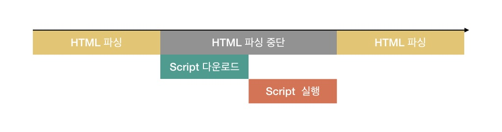
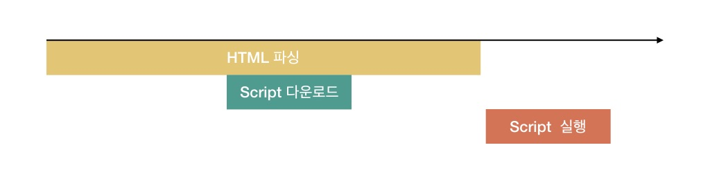

# `<script>`, `<script async>`, `<script defer>`

* [`<script>`](#script)
* [`<script async>`](#script-async)
* [`<script defer>`](#script-defer)

## `<script>`

```html
<script src ="..."></script>
```



브라우저가 HTML을 파싱 하다가 `<script>` 태그를 만날 경우 브라우저는 해당 스크립트를 즉시 실행하려고 합니다.

`<script src="...">` 과같이 외부 스크립트를 사용할 경우, HTML 파싱을 멈추고 스크립트가 로드 될 때까지 기다립니다.

스크립트가 로딩된 후, 스크립트를 실행시키고 다시 이후 HTML 파싱을 진행합니다.

이런 이유로 스크립트가 초기 페이지 렌더링을 중단 시키지 않도록 하기 위해 `<script>` 태그를 `<body>` 태그 안의 맨 마지막에 위치시킵니다.

```html
<html>
  <body>
    ...

    <script src= "..."></script>
  <body>
</html>
```

## `<script async>`

```html
<script async src ="..."></script>
```


`<script>`에 `async` 속성을 사용하면 HTML 파싱을 막지 않고 스크립트를 로딩합니다.

해당 스크립트가 로딩이 끝나면 HTML 파싱을 막고 스크립트를 실행합니다.

스크립트 로딩이 완료되면 즉시 실행하기 때문에, 실행 순서가 보장되지 않습니다.

## `<script defer>`

```html
<script defer src ="..."></script>
```



`<script>`에 `defer` 속성을 사용하면 HTML 파싱을 막지 않고 스크립트를 로딩합니다.

HTML 파싱이 끝난 후, script 선언 순서대로 스크립트를 실행시킵니다.
