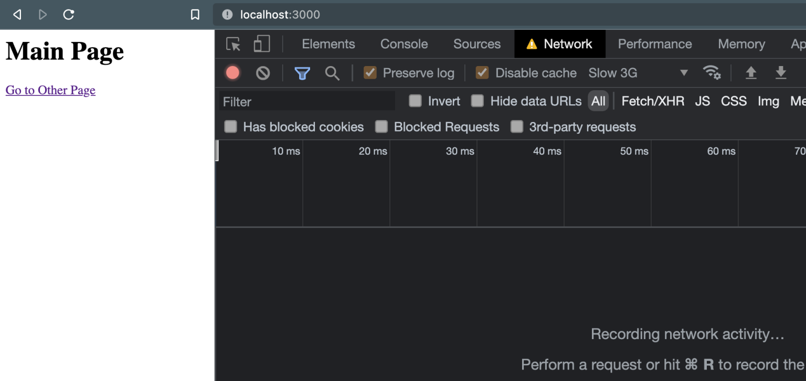
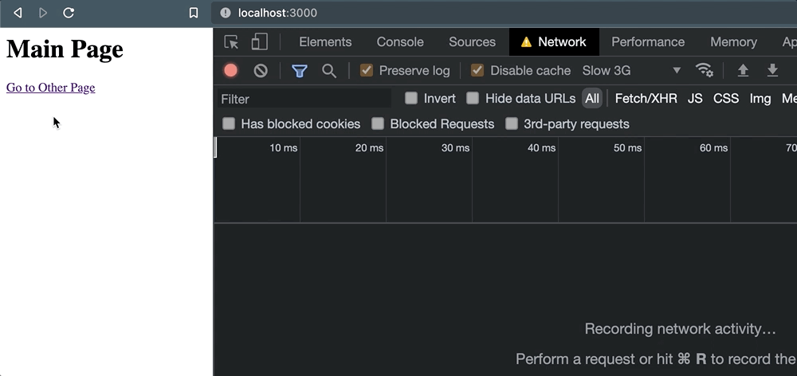

# 사용자가 페이지를 떠날 때 안정적으로 HTTP 요청 보내기

> 이 글은 [Alex AcArthur](https://css-tricks.com/author/alexmacarthur/)가 작성한 [Reliably Send an HTTP Request as a User Leaves a Page](https://css-tricks.com/send-an-http-request-on-page-exit/)를 번역한 글입니다 ([CSS-Tricks 번역 정책 참고](https://css-tricks.com/translate-an-article/)).

사용자가 다른 페이지로 이동하거나 양식을 제출하는 등의 행동을 할 때, 로깅할 데이터가 포함된 HTTP 요청을 전송해야 하는 경우가 여러 번 있었습니다.
링크를 클릭하면 일부 정보를 외부 서비스로 전송하는 예시를 생각해 보세요: 

```html
<a href="/some-other-page" id="link">Go to Page</a>

<script>
document.getElementById('link').addEventListener('click', (e) => {
  fetch("/log", {
    method: "POST",
    headers: {
      "Content-Type": "application/json"
    }, 
    body: JSON.stringify({
      some: "data"
    })
  });
});
</script>
```

여기에 크게 복잡한 건 없습니다.
보통 그렇듯이 (`e.preventDefault()`를 사용하지 않았습니다.) 링크는 정상적으로 동작하도록 했지만, 링크가 동작하기 전, `click` 시에 `POST` 요청이 발생합니다.
어떤 종류의 응답도 기다릴 필요가 없습니다.
어떤 결과를 받던지 **단지 전송만** 하기를 원합니다.

언뜻 보면, 해당 요청의 전송이 동기화된 것처럼 보이고, 그 후 다른 서버가 요청을 성공적으로 처리하는 동안 페이지를 계속 탐색할 것처럼 보입니다.
하지만 밝혀진 바로, 항상 그런 것은 아닙니다.

## 브라우저는 열린 HTTP 요청의 보존을 보장하지 않습니다.

무언가 브라우저의 페이지를 종료시킬 때, 진행 중인 HTTP 요청이 성공적으로 처리된다는 보장은 없습니다([페이지 생명 주기의 "terminated" 및 다른 상태](https://developer.chrome.com/blog/page-lifecycle-api/) 참고).
이런 종류의 요청의 신뢰성은 네트워크 연결, 애플리케이션 성능 및 외부 서비스 자체 설정과 같은 몇 가지 요소에 따라 달라질 수 있습니다.

따라서, 이러한 시점에 데이터를 전송하는 것은 결코 신뢰할 수 없으며, 이런 로그에 의존해 데이터에 민감한 비즈니스 의사결정을 내리게 되면 잠재적으로 큰 문제가 발생할 수 있습니다.

비신뢰성에 대한 설명을 위해 위 코드를 포함한 페이지가 있는 작은 Express 애플리케이션을 만들었습니다.
링크가 클릭되었을 때 브라우저는 `/other`로 이동합니다, 하지만 그전에 POST 요청이 발생합니다.

모든 과정 동안, 저는 브라우저의 네트워크 탭을 열어두고 연결 속도를 "Slow 3g"로 사용했습니다.
페이지를 로드하고 로그를 지웠습니다, 아무런 문제도 없는 것처럼 보입니다:



하지만 링크를 클릭하면 일이 꼬입니다.
페이지 이동이 발생할 때, 요청이 취소됩니다.



따라서 외부 서비스가 실제로 요청을 처리할 수 있었다는 확신을 할 수 없습니다.
이 동작을 확인하기 위해 `window.location`을 이용해 프로그래밍적으로 페이지를 이동해도 같은 문제가 발생합니다.

```js
document.getElementById('link').addEventListener('click', (e) => {
+ e.preventDefault();

  // 요청이 대기열에 들어갔지만, 페이지 이동이 일어나면서 취소됩니다.
  fetch("/log", {
    method: "POST",
    headers: {
      "Content-Type": "application/json"
    }, 
    body: JSON.stringify({
      some: 'data'
    }),
  });

+ window.location = e.target.href;
});
```

언제 어떻게 페이지 이동이 발생하고 활성 페이지가 종료되는 지와 관계없이, 이런 완료되지 않은 요청은 취소될 위험이 있습니다.

## 근데 왜 취소될까요?

근본적인 원인은, 기본적으로 XHR 요청(`fetch` 혹은 `XMLHttpRequest`에 의한)은 비동기적이고 블로킹이 없다는 것입니다.
요청이 대기열에 들어가자마자, 요청의 실제 *작업*은 백그라운드에서 브라우저 레벨의 API로 전달됩니다.

우리는 요청이 메인 스레드를 독차지하는 것을 원하지 않기 때문에 이는 성능 면에서 좋습니다.
하지만 이는 페이지가 "terminated" 상태가 될 때 요청이 버려질 위험이 있다는 것을 뜻하며, 그 어떤 백그라운드 작업도 완료된다는 보장이 없습니다.
여기 [Google 이 라이프 사이클 상태](https://developer.chrome.com/blog/page-lifecycle-api/#states)에 대해 어떻게 요약했는지 보겠습니다:

> 브라우저 메모리에서 내려가고 지워지기 시작하면 페이지는 terminated 상태가 됩니다.
> 이 상태에서는 [새로운 작업](https://html.spec.whatwg.org/multipage/webappapis.html#queue-a-task)이 시작되지 않으며, 진행 중인 작업이 너무 오래 실행될 경우 중지될 수 있습니다.

간단히 말해서, 브라우저는 페이지가 삭제될 때, 페이지에 의해 대기 중인 백그라운드 프로세스를 계속 처리할 필요가 없다는 가정 하에 설계되었습니다.

## 그래서, 우리가 선택할 수 있는 건 무엇일까요?

아마 이 문제를 피하기 위한 가장 명확한 접근 방법은 요청이 응답을 반환할 때까지 사용자 작업을 지연시키는 것입니다.
예전에는, `XMLHttpRequest`에서 지원하는 [synchronous 플래그](https://xhr.spec.whatwg.org/#synchronous-flag)를 사용하는 잘못된 방식으로 하곤 했습니다.
하지만 이를 사용하면 메인 스레드를 완전히 차단시키고, 여러 성능 문제가 발생합니다 - 저는 이런 문제에 대한 [글](https://macarthur.me/posts/use-web-workers-for-your-event-listeners)을 작성했었습니다 - 그래서 이 방식은 고려할 필요도 없습니다.
사실, 이 기능은 플랫폼에서 제거되고 있습니다 ([Chrome v80+에서는 이미 제거되었습니다.](https://developer.chrome.com/blog/chrome-80-deps-rems/))

대신, 이런 접근 방식을 사용할 경우 응답이 반환되어 `Promise` 가 resolve 될 때까지 기다리는 것이 좋습니다.
다시 돌아온 후에는 안전하게 동작을 수행할 수 있습니다.
앞선 예제를 사용하면, 아래처럼 할 수 있습니다.

```js
document.getElementById('link').addEventListener('click', async (e) => {
  e.preventDefault();

  // 응답이 돌아오기를 기다리고...
  await fetch("/log", {
    method: "POST",
    headers: {
      "Content-Type": "application/json"
    }, 
    body: JSON.stringify({
      some: 'data'
    }),
  });

  // ...나서 페이지를 이동한다.
   window.location = e.target.href;
});
```

이러면 작업을 완료할 수 있지만, 몇 가지 사소하지 않은 단점이 있습니다.

**첫째, 원하는 동작이 발생하지 않도록 지연시킴으로써 사용자 경험을 손상시킵니다.**
분석 데이터를 수집하는 것은 확실히 비즈니스(그리고 잠재적 사용자들)에게 이익이 되지만, *현재* 사용자가 그 이익을 위해 비용을 지불하도록 하는 것은 이상적이지 않습니다.
말할 것도 없이, 외부 종속성에 의해, 그 서비스 자체가 가진 어떠한 지연이나 성능 문제가 사용자에게 보여지게 됩니다.
분석 서비스에서 타임아웃이 발생해서 고객이 중요한 작업을 하지 못하면 모든 사람이 손해를 보게 됩니다.

**둘째, 몇몇 종료 동작은 프로그래밍 방식으로 지연시킬 수 없기 때문에 이런 접근은 앞에서 들었던 것처럼 신뢰할 수 없습니다.**
예를 들어 `e.preventDefault()`는 브라우저 탭을 닫는 것을 지연시킬 때는 효과가 없습니다.
그래서 기껏해야, *일부* 사용자 작업에 대한 데이터 수집은 커버할 수 있지만 종합적으로 신뢰할 수 있을 정도는 아닙니다. 

## 브라우저에 미처리 요청을 보존하도록 지시하기

다행히, 미처리 HTTP 요청을 *보존*할 수 있는 옵션이 있고, 이는 대부분의 브라우저에 내장되어 있으며 사용자 경험을 손상시키지 않습니다.

### Fetch 의 `keepalive` 플래그 사용하기

`fetch()`를 사용할 때 [keepalive](https://fetch.spec.whatwg.org/#request-keepalive-flag) 플래그가 `true`로 설정되어 있으면, 해당 요청을 시작한 페이지가 종료되더라도 해당 요청이 열린 상태로 유지됩니다. 
처음 예제를 사용하면 다음과 같이 구현할 수 있습니다.

```html
<a href="/some-other-page" id="link">Go to Page</a>

<script>
  document.getElementById('link').addEventListener('click', (e) => {
    fetch("/log", {
      method: "POST",
      headers: {
        "Content-Type": "application/json"
      }, 
      body: JSON.stringify({
        some: "data"
      }), 
      keepalive: true
    });
  });
</script>
```

해당 링크를 클릭하고 페이지 이동이 발생해도, 요청 취소가 발생하지 않습니다:


대신, `(unknown)` 상태가 남게 되는데, 단순히 활성 페이지가 어떤 종료의 응답도 기다리지 않기 때문입니다.

특히, 일반적으로 사용되는 브라우저 API의 일부인 경우 이와 같이 한 줄이면 쉽게 해결할 수 있습니다.
그러나 더 단순한 인터페이스를 가진 더 집중적인 옵션을 찾고 있다면, 브라우저 지원을 받는 다른 방법도 있습니다.

### `Navigator.sendBeacon()` 사용하기

`Navigator.sendBeacon()` 함수는 단방향 요청을 전송하기 위해 특별히 고안되었습니다 ([beacons](https://w3c.github.io/beacon/#sec-processing-model)).
기본 구현은 다음과 같습니다. 직렬화된 `JSON` 과 “text/plain” `Content-Type` 을 포함한 `POST` 요청을 전송합니다:

```js
navigator.sendBeacon('/log', JSON.stringify({
  some: "data"
}));
```

하지만, 이 API는 커스텀 헤더를 보내도록 허용하지 않습니다.
그래서, 데이터를 “application/json” 로 전송하려면 `Blob`을 사용해 약간 수정해서 사용해야 합니다:  

```html
<a href="/some-other-page" id="link">Go to Page</a>

<script>
  document.getElementById('link').addEventListener('click', (e) => {
    const blob = new Blob([JSON.stringify({ some: "data" })], { type: 'application/json; charset=UTF-8' });
    navigator.sendBeacon('/log', blob);
  });
</script>
```

결국, 동일한 결과를 얻을 수 있습니다 - 페이지 이동 후에도 요청을 완료할 수 있습니다.
하지만 `fetch()` 보다 나은 점이 있습니다: 비콘은 낮은 우선순위로 전송됩니다.

설명을 위해, 여기 `keepalive` 가 있는 `fetch()`와 `sendBeacon()`이 동시에 사용될 때 네트워크 탭에 표시되는 것입니다: 


기본적으로, `fetch()`는 “High” 우선 순위를 받는 반면, 비콘은(위에서 “ping” 유형으로 표시됨)은 “Lowest” 우선 순위를 가집니다.
페이지 기능에 중요하지 않은 요청의 경우 이 방법은 좋습니다.
[Beacon 스펙](https://www.w3.org/TR/beacon/)에서 발췌한 내용입니다:

> 이 스펙은 다음 인터페이스를 정의합니다 […] 시간적으로 중요한 다른 작업과 리소스 경합을 최소화하면서 요청이 계속 처리되고 대상으로 전달되도록 보장합니다.

다른 말로하면, `sendBeacon()` 은 그 요청이 애플리케이션에 중요한 것들과 사용자 경험에 관여하지 않도록 합니다.

## `ping` 속성에 대한 훌륭한 언급

점점 더 많은 브라우저들이 [ping 속성](https://css-tricks.com/the-ping-attribute-on-anchor-links/)을 지원한다는 것을 언급할 가치가 있습니다.
링크에 사용되면 이는 작은 `POST` 요청을 전송합니다.

```html
<a href="http://localhost:3000/other" ping="http://localhost:3000/log">
  Go to Other Page
</a>
```
이 요청 헤더에는 링크가 클릭된 페이지(`ping-from`)와 해당 링크의 `href` 값(`ping-to`)이 포함됩니다: 

```js
headers: {
  'ping-from': 'http://localhost:3000/',
  'ping-to': 'http://localhost:3000/other'
  'content-type': 'text/ping'
  // ...다른 헤더들
},
```

이는 비콘 전송과 기술적으로 유사하지만, 주목할 만한 제한사항이 있습니다.

1. **링크에서만 사용할 수 있도록 엄격하게 제한되므로**, 버튼클릭이나 양식 제출과 같은 다른 상호작용과 관련된 데이터를 추적해야 하는 경우 사용할 수 없습니다.

2. **브라우저 지원이 나쁘지는 않지만, [아주 좋지는 않습니다](https://caniuse.com/ping)**. 글을 작성하는 현재, Firefox는 기본적으로 이를 사용하지 않도록 설정되어 있습니다.

3. **요청과 함께 커스텀 데이터를 보낼수 없습니다.** 언급한 바와 같이 몇가지 ping-* 헤더와 몇가지 다른 헤더를 같이 얻을 수 있습니다.

모든 것을 고려해 볼 때, `ping` 은 간단한 요청으로 충분하고 커스텀 JavaScript 를 작성하지 않으려는 경우 좋은 방법입니다.
하지만 더 중요한 것을 보내야한다면, 가장 좋은 방법은 아닐 수 있습니다.

## 그래서 어떤것을 사용해야 할까요?

`keepalive`와 함께 `fetch`를 사용하거나 `sendBeacon()`을 사용하여 마지막 요청을 전송하는 것에는 분명한 트레이드오프가 있습니다.
다양한 상황에 가장 적합한 항목을 식별하기 위해 고려해야 할 몇 가지 사항은 다음과 같습니다:

### 아래와 같은 경우에는 `fetch()` + `keepalive` 를 사용하는 것이 좋습니다.

- 요청과 함께 커스텀 헤더를 쉽게 전달해야 합니다.
- 서비스에 `POST` 가 아닌 `GET` 요청을 하려고 합니다.
- 예전 브라우저(IE 같은)를 지원하고 있으며 이미 `fetch` 폴리필이 로드되어 있습니다.

### 하지만 아래의 경우에는 `sendBeacon()`이 더 좋은 선택일 수 있습니다.

- 커스텀이 많이 필요하지 않은 간단한 서비스 요청을 하고 있습니다.
- 깔끔하고 우아한 API 를 선호합니다.
- 요청이 애플리케이션에서 발송되는 다른 높은 우선순위의 요청과 경쟁하지 않도록 보장하려 합니다

## 제 실수를 반복하지 마세요

페이지가 종료될 때 브라우저가 처리 중인 요청을 다루는 방식에 대해서 자세히 알아보기로 한 이유가 있습니다.
얼마 전, 우리 팀은 양식을 제출할 때 요청을 실행하기 시작한 후 갑자기 특정 유형의 분석 로그 빈도가 변하는 것을 보았습니다.
이 변화는 갑작스러웠고 중요했습니다 - 과거에 보았던 것보다 약 ~30% 감소했습니다.

이 문제가 발생한 이유와 이를 피할 수 있는 도구를 파헤쳐 곤경을 면할 수 있었습니다.
그래서, 저는 이런 도전들의 뉘앙스를 이해하는 것이 누군가 우리가 마주친 고통의 일부를 피하는데 도움이 되기를 바랍니다.
Happy logging!