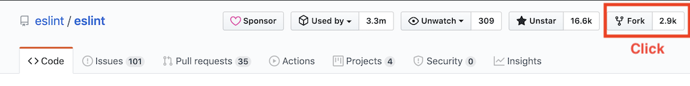
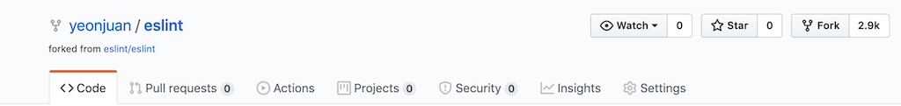
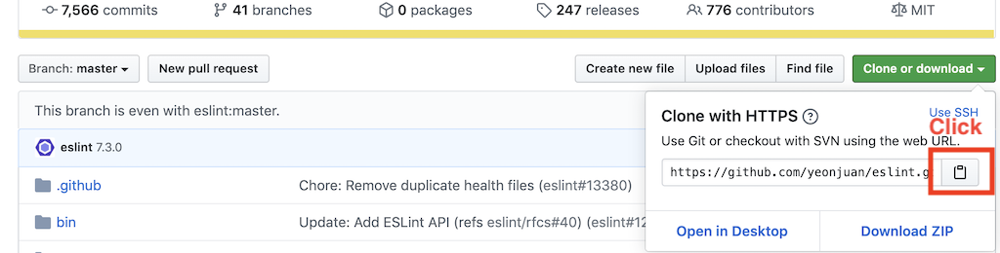

# 오픈소스 컨트리뷰션 Git/Github 사용법

오픈소스에 컨트리뷰션에 필요한 Git/Github 사용법에 대해 정리한 글입니다.

* [컨트리뷰션 플로우](#컨트리뷰션-플로우)
* [Fork](#Fork)
* [Clone](#Clone)
* [Branch](#Branch)
* [File Status LifeCycle](#File-Status-LifeCycle)
* [Pull Request](#pull-request)
* [Review & Merge](#Review-&-Merge)
* [Fork 한 레포지토리와 동기화](#Fork-한-레포지토리와-동기화)

# 컨트리뷰션 - Git/Github 워크 플로우


# Fork

fork는 다른 사람의 Github 저장소를 내 Github 레포지토리로 그대로 복사해 가져오는 기능입니다.

## Fork 하는 방법

다른 사람의 레포지토리를 fork 하는 방법은 간단합니다.
fork 할 Github 레포지토리 페이지에서 "fork" 버튼을 클릭합니다.



잠시 기다리면, 내 Github 레포지토리에 fork 된 레포지토리가 생성됩니다.



# Clone

clone 은 저장소를 원격 저장소를 복사해서 로컬에 가져오는 기능입니다.

## Clone 하는 방법

레포지토리를 clone 하기 위해서 먼저 복사할 레포지토리의 주소를 가져옵니다.
레포지토리 주소는 Github 레포지토리 페이지에서 쉽게 복사할 수 있습니다.



이후 로컬 터미널에서 아래 명령어를 통해 레포지토리를 clone 합니다.

```bash
$ git clone [복사할 레포지토리.git]
```

레포지토리를 clone 하게되면 `origin` 이라는 이름으로 원격 저장소가 프로젝트에 등록됩니다.

remote 명령어로 프로젝트에 등록된 원격 저장소 목록을 확인할 수 있습니다.

```bash
$ git remote -v

origin  https://github.com/yeonjuan/dev-blog.git (fetch)
origin  https://github.com/yeonjuan/dev-blog.git (push)
```

# Branch

branch 는 개발을 할때 동시에 다른 작업을 독립적으로 할 수 있게 만들어주는 개념입니다.

보통, 기준이되는 브랜치에서 새로운 브랜치를 만들어 소스코드를 수정한 다음 다시 합치는(merge) 방식으로 작업을 진행합니다.

## Branch 확인

아래 명령어로 프로젝트의 branch 목록을 확인할 수 있습니다.
`*` 은 현재 선택된 branch 를 나타냅니다.

```bash
$ git branch

* master
  develop
...
```

## Branch 생성

아래 명령어로 branch를 생성할 수 있습니다.

```bash
$ git branch <branch 이름>
```

checkout 명령어를 통해 특정 브랜치로 이동할 수 있습니다.

```bash
$ git checkout <branch 이름>
```

checkout 에 -b 옵션읉 통해 브랜치 생성과 동시에 이동할 수 있습니다.

```bash
$ git checkout -b <branch 이름>
```

## Branch 관련 기타 명령어

* 원격 branch 가져오기

```bash
$ git checkout -t <branch 이름>
```

* 로컬 branch 삭제하기

```bash
$ git branch -d <branch 이름>
```

## Branch 전략

Branch 사용법에 따라 다양한 전략이 있습니다.

-  

# File Status Lifecycle


# Pull Request

# Review & Merge

# Fork 한 레포지토리와 동기화
