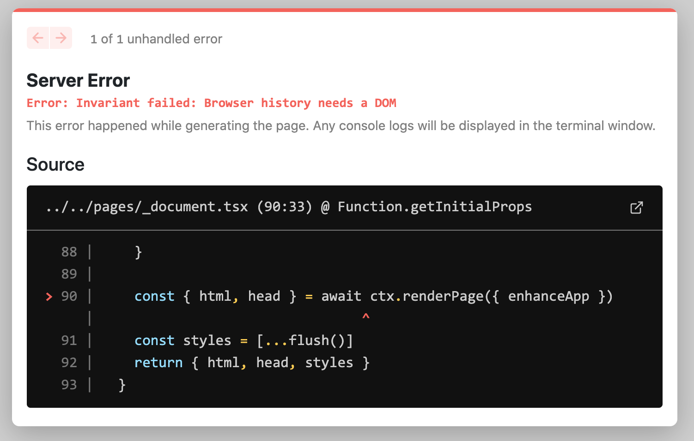

# Next.js 와 React Router로 싱글 페이지 애플리케이션 만들기

> 원문: https://colinhacks.com/essays/building-a-spa-with-nextjs

최근 Next.js 를 이용하여 싱글 페이지 애플리케이션(SPA)를 구현하기 시작했습니다.

명확하게 말씀드리면, 저는 "SPA"라는 용어를 매우 특정한 방식으로 사용하고 있습니다.
모든 데이터 패치, 렌더링, 라우팅을 클라이언트 사이드에서 처리하는 애플리케이션인 "엣날 방식"의 SPA 모델을 의미합니다.

그런데 Next.js에서는 이 작업이 쉽지 않습니다.

## 왜 Next.js의 라우팅을 사용하지 않나요?

Next.js는 React Router 만큼 유연하지 않습니다!
React Router를 사용하면 유연한 방식으로 라우터를 계층적으로 중첩할 수 있습니다.
"부모" 라우터는 모든 "자식" 라우터와 데이터를 쉽게 공유할 수 있습니다.
이는 최상위 라우터와(예: `/about` 과 `/team`) 중첩된 라우터(예: `/settings/team` 과 `/settings/user`)에서도 가능합니다.

이는 Next.js에 내장된 라우터로는 불가능합니다! 대신 _모든_ 공유 상태 및 레이아웃을 직접 만든 `_app.tsx` 컴포넌트에서 초기화해야 합니다.
이는 하나의 최상위 React Router 만으로 앱을 구축하는 것과 같습니다.
Next.js가 "중첩된 라우트"를 정의할 수 있게 해준다 해도 이는 사실입니다.
실제로 Next.js는 모든 라우트를 "평탄"하게 만듭니다.

Next에서 이를 구현하기 위해 복잡하고 해키(hacky)한 방법들이 있습니다. Adam Wathan이 [여기서](https://adamwathan.me/2019/10/17/persistent-layout-patterns-in-nextjs/) 설명한 몇 가지 방법들이 그 예시입니다.
Next.js의 라우팅 시스템을 사용하기로 결정한 경우 이런 접근 방식을 검토해야 합니다.

## 왜 Next.js를 사용하나요?

왜냐하면 멋지기 때문입니다!
동적 import 기능으로 번들을 분할할 수 있으므로 대규모 SPA와 관련된 가장 큰 성능 문제 중 하나를 해결할 수 있습니다.
또한 Vercel에 쉽게 배포할 수 있으며, 별도의 클라이언트 및 서버 코드 베이스를 유지하는 대신 API 라우트를 사용해 API를 구축할 수 있습니다.
게다가 멋지고 새로운 `<Image>` 컴포넌트도 제공합니다.

하지만 Next.js의 가장 매력적인 기능은 별도의 설정 없이 클라이언트와 서버 간에 코드를 공유할 수 있다는 점입니다.

클라이언트와 서버 간에 코드와 타이핑을 공유할 수 있다는 것은 대단한 장점입니다.
개발자 경험이 Lerna 보다 10배, Yarn 워크스페이스 보다는 100배는 더 좋습니다.(절 믿으세요)
이 기능은 종단간 안전한 타입의 데이터 레이어를 구축할 수 있는 새로운 라이브러리 [github.com/colinhacks/trpc](https://github.com/trpc/trpc)의 기반이 되는 기능입니다.
더 좋은 점은 API를 완전히 추상화하여 클라이언트에서 직접 서버 측 함수를 호출할 수 있다는 점입니다.
전 편애하고 있긴 하지만 정말 멋진 기능입니다.
자세한 내용은 [github.com/colinhacks/trpc](https://github.com/trpc/trpc)에서 확인해 보세요!✨

## 구현

상호작용이 많은 `대시보드 스타일` SaaS 개발에서 여전히 지배적인 패러다임은 SPA입니다.
안타깝게도 Next.js는 라우팅이라는 한 가지 근본적인 이유 때문에 SPA 패러다임과 (거의) 호환되지 않습니다.

일반적인 SPA는 클라이언트 측 라우팅에 의존하는 반면, Next.js는 자체 페이지 기반 라우팅 시스템이 내장되어 있습니다. 일반적으로 [react-router](https://reactrouter.com/en/main)와 같은 라이브러리를 사용합니다.

아래에서는 Next 앱에서 React Router를 사용하려고 할 때 발생한 모든 오류와 그 해결 방법을 설명하겠습니다.
데모를 위해 아래의 간단한 라우터를 사용하겠습니다.
이 라우터는 [react-router 문서](https://reactrouter.com/en/6.11.2/web/guides/quick-start#quick-start-1st-example-basic-routing)의 "Basic Routing" 예제를 단순화한 버전입니다.

```jsx
import React from "react";
import { BrowserRouter as Router, Routes, Route, Link } from "react-router-dom";

export default function App() {
  return (
    <Router>
      <div>
        <ul>
          <li>
            <Link to="/">Home</Link>
          </li>
          <li>
            <Link to="/about">About</Link>
          </li>
        </ul>

        <Routes>
          <Route path="/about" element={<h1>About</h1>} />
          <Route path="/" element={<h1>Home</h1>} />
        </Routes>
      </div>
    </Router>
  );
}
```

## `Browser history needs a DOM`

먼저 새로운 Next.js 앱을 만들고, React Router를 설치한 다음 (`npm install react-router-dom`), 위 라우터 코드를 `pages/index.tsx`에 붙여 넣어 보겠습니다.
그리고 `next dev`를 실행하면 즉시 `Invariant failed: Browser history needs a DOM ` 에러가 발생합니다.



이는 Next.js가 개발 모드에서 개발 서버에 페이지를 미리 렌더링하려고 시도하기 때문에 발생합니다.
반면 React Router는 브라우저에서 제공하는 전역 `window` 객체에 접근이 필요합니다.
서버 환경에서는 `window`를 사용할 수 없기 때문에 React Router가 작동을 멈춥니다.

이 문제를 해결하려면 (두둥) [커스텀 앱](https://nextjs.org/docs/pages/building-your-application/routing/custom-app)을 사용해야 합니다!
`pages/_app.tsx` (또는 `pages/_app.js` 만약 당신이 괴물이라면)이라는 파일을 추가합니다.
이 문제를 해결하기 위해 순진한 접근 방식을 시도해 봅시다.
`window`가 정의되지 않은 경우 `null`을 반환하고, 그렇지 않으면 페이지를 렌더링 합니다.

```jsx
import { AppProps } from "next/app";
import { useEffect, useState } from "react";

function App({ Component, pageProps }: AppProps) {
  if (typeof window === "undefined") return null;
  return <Component {...pageProps} />;
}
export default App;
```

## `Hydration failed`

페이지를 다시 로드하면 새로운 오류가 표시됩니다.


Next.js 앱의 페이지를 로드하면 Next.js는 1) 서버에서 사전 렌더링을 시도하고 2) 결과를 브라우저로 전송한 다음 3) 브라우저에서 페이지를 "re-hydrates" 합니다. Re-hydration은 브라우저에서 다시 렌더링하고 서버에서 렌더링한 버전과 비교하는 것을 의미합니다.
두 버전이 일치하지 않으면 React는 오류를 발생시킵니다.

좀 더 영리하게 생각해 봅시다.

```jsx
import { AppProps } from "next/app";
import { useEffect, useState } from "react";

function App({ Component, pageProps }: AppProps) {
  const [render, setRender] = useState(false);
  useEffect(() => setRender(true), []);
  return render ? <Component {...pageProps} /> : null;
}
export default App;
```

이 접근 방식은 `useState` 와 `useEffect`를 사용합니다.
Next.js가 서버에서 페이지를 렌더링할 때 `useEffect`를 호출하지 않고 기본값을 사용하여 페이지를 렌더링한 후 결과를 반환합니다.

이 페이지가 브라우저에 의해 로드되면 기본값을 사용하여 페이지를 렌더링하는 동일한 작업을 수행합니다.
렌더링의 기본값이 `false`이므로 브라우저는 처음에 `null`을 렌더링합니다.
이는 서버에서 렌더링된 페이지 버전과 일치하기 때문에 좋습니다.

그 직후 브라우저는 `useEffect` 호출을 실행하여 `render`를 `true`로 설정합니다.
이제 페이지가 완전한 모습으로 다시 렌더링 됩니다.
처음에는 `null`을 렌더링하는 데 약간의 시간이 낭비되지만, 이는 밀리초 미만의 아주 미세한 시간입니다.

## `404 Page Not Found`

React Router와 Next.js 라우터는 이상하고 예상치 못한 방식으로 상호 작용할 수 있습니다.
이 문제를 이해하려면 클라이언트 사이드 라우팅과 "서버 사이드 라우팅"의 차이점을 이해해야 합니다.

현재 `pages/index.tsx`는 2개의 "페이지"를 구현하고 있습니다: 홈페이지(`/`)와 about 페이지 (`/about`)로 입니다.

이렇게 해보세요.

1. `localhost:3000`로 이동하세요.
2. "About" 링크를 클릭하세요.

URL이 `localhost:3000/about`으로 변경되고 about "페이지"가 표시됩니다.
좋습니다! 하지만

3. 페이지를 새로고침하세요.

이제 404가 표시됩니다.
왜 그럴까요?
`localhost:3000/about`은 새로고침하기 전엔 잘 동작했습니다.

Next.js의 입장에서는 홈페이지(`localhost:3000`)가 존재하는 _유일한_ 페이지 입니다.
페이지가 로드되면 react-router가 URL바의 제어권을 장악합니다.
react-router의 `<Link>`를 클릭하면 URL이 프로그래밍 방식으로 변경되지만 페이지가 완전히 새로고침되지는 않습니다.

그러나 페이지를 새로 고치면 브라우저는 Next.js에 `localhost:3000/about`에 대한 컨텐츠를 제공하도록 요청합니다.
페이지를 구현하지 않았기 때문에 Next.js는 포기하고 404를 던집니다.

해결 방법은 [Rewrites](https://nextjs.org/docs/pages/api-reference/next-config-js/rewrites) 입니다!

이 기능은 Next.js9.5에서 사용할 수 있게 되었습니다. Rewrites는 "URL 별칭"과 같으며 일부 "source" URL을 다른 "destination" URL에 매핑하도록 Next.js에 지시할 수 있습니다.
`next.config.js`에 이 설정을 할 수 있습니다(해당 파일이 없는 경우 프로젝트의 루트에 생성해야합니다.)
다음의 내용을 추가합니다.

```js
// next.config.js
module.exports = {
  async rewrites() {
    return [
      {
        source: "/:any*",
        destination: "/",
      },
    ];
  },
};
```

이 rewrite 규칙은 들어오는 모든 요쳥(`/:any\*`)을 홈페이지(`/`)에 매핑합니다.

이제 서버를 다시 시작하고 `localhost:3000/about`에 접속하면 `index.tsx` 홈페이지가 렌더링 되어야 합니다.

## 클라이언트 사이드 렌더링과 서버 사이드 렌더링 혼합하기

주의할 점: 들어오는 요청이 pages 디렉터리의 기존 페이지에 해당하는 경우 Next.js는 이 rewrite 규칙을 무시합니다.
예를 들어, 나중에 `pages/about.tsx`를 추가하면 Next.js는 홈페이지에 `/about`을 다시 작성하는 것을 멈춥니다.


정말 멋진 기능입니다! 우선, 추가 구성없이 API Routes를 사용할 수 있습니다.
하지만 더 중요한 것은 SPA, SSR, SSG 패러다임을 마음대로 섞어서 사용할 수 있다는 점입니다!
예를 들어 서버사이드에서 렌더링되는 `/settings`페이지를 추가할 수 있습니다.

1. `pages/settings.tsx`를 생성하고 구현합니다.
2. `getServerSideProps` 를 추가합니다.
3. `next/link` (`react-router-dom` 이 아닌)의 `<Link>` 컴포넌트를 사용해서 `/settings`로 이동하는 링크를 추가합니다.

이제 SPA내에서 싱글 서버 사이드 페이지가 생겼습니다!. create-react-app으로는 불가능합니다.🙃

## 정리

이 포스팅에 영감을 주고 정보를 준 Tanner Linsley의 CRA에서 Next.js 로 전환하는 방법에 대한 [Github Gist](https://gist.github.com/tannerlinsley/65ac1f0175d79d19762cf06650707830)에 감사를 표합니다.

제가 사용한 전체 코드는 데모 저장소 [github.com/colinhacks/nextjs-spa](github.com/colinhacks/nextjs-spa)에서 확인할 수 있습니다.

이 게시물의 '댓글 섹션'은 이 트위터 스레드입니다.
참여하세요! 저는 Next.js, TypeScript, 오픈 소스 소프트웨어 등 거의 모든 것에 대해 토론하는 것을 좋아합니다!

- [트위터 스레드](https://twitter.com/colinhacks/status/1321871817095684097?ref_src=twsrc%5Etfw%7Ctwcamp%5Etweetembed%7Ctwterm%5E1321871817095684097%7Ctwgr%5E70c95e2373f525c700b50dc06beca3ec0b3a0c1a%7Ctwcon%5Es1_&ref_url=https%3A%2F%2Fcolinhacks.com%2Fessays%2Fbuilding-a-spa-with-nextjs)

Next.js나 TypeScript에 관심이 있으시다면 [트위터 @colinhacks](https://twitter.com/colinhacks)에서 저를 팔로우하세요!
저는 [Zod](https://github.com/colinhacks/zod)(TypeScript 유효성 검사 라이브러리)와 [tRPC](https://github.com/trpc/trpc)(TypeScript로 종단간 안전한 타입 API를 구축하기 위한 도구)와 같은 오픈소스 도구를 구축하고 유지 관리합니다.
또는 뉴스레터를 구독하여 새 게시물을 게시할 때 알림을 받아보세요!
