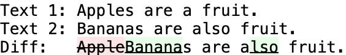
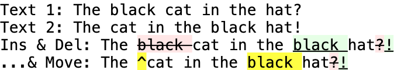
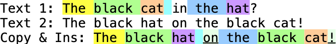
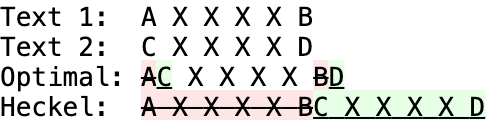
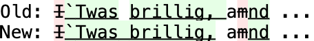
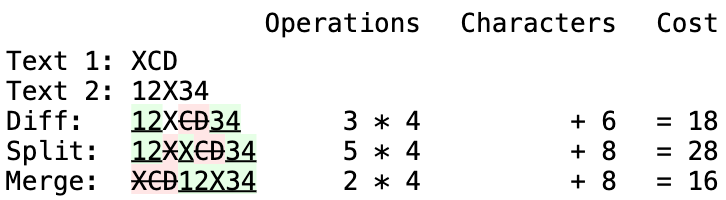
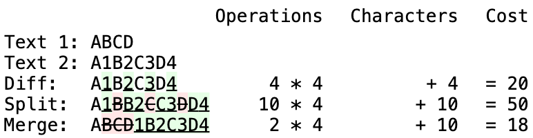
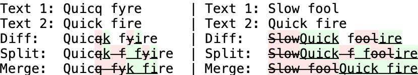
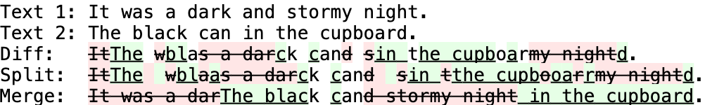

# Diff 전략

> 원문: https://neil.fraser.name/writing/diff/

두 시퀀스 간의 차이점을 계산하는 것은 많은 애플리케이션의 핵심입니다.
아래는 두 텍스트의 차이점을 계산하는 간단한 예입니다.



이 문서에서는 차이점 알고리즘에 관한 문헌을 조사하고 비교하며, 실질적으로 알고리즘의 유용성을 개선하기 위한 몇 가지 기법에 대해 설명합니다.
특히 전처리 최적화, 최적의 차이점 알고리즘을 선택하기 위한 전략, 후처리 정리에 대해 설명합니다.

---

# 1. 전처리 최적화

가장 유명한 차이점 알고리즘조차도 계산 비용이 큰 작업입니다.
대부분의 실제 사례에서 비교 대상이 되는 두 시퀀스(보통 텍스트)는 서로 어느 정도 유사합니다.
이 사실을 통해 알고리즘의 실제 실행 시간을 개선할 수 있는 몇 가지 최적화를 적용할 수 있으며, 경우에 따라 알고리즘을 실행할 필요성을 완전히 없앨 수도 있습니다.

## 1.1 동일성

가장 확실하고 간단한 최적화는 동일성 검사입니다.
두 시퀀스가 동일할 확률은 매우 낮지만 이를 확인하는 것은 매우 간단하므로 동일성 확인을 먼저 하는 것이 합리적입니다.
이 검사의 부수 작용은 뒤이은 코드를 단순화할 수 있다는 것입니다.
검사가 끝나면 차이점이 있다는 것이 보장되므로 null 케이스가 배제됩니다.

```js
if (text1 == text2)  
  return null;  
```

## 1.2 공통 접두사/접미사

텍스트 간에 어떤 공통점이 있다면 시작 혹은 끝부분에 공통된 부분 문자열이 있을 가능성이 높습니다.

```text
Text 1: The cat in the hat.
Text 2: The dog in the hat.
```

이는 다음과 같이 단순화될 수 있습니다.

```text
Text 1: cat
Text 2: dog
```

공통 부분 문자열 탐색은 이진 탐색을 사용하여 O(log n)에 수행할 수 있습니다.
이진 탐색은 극단적인 경우 효율성이 가장 떨어지고 현실 세계에서는 공통성이 0인 경우가 드물지 않기 때문에 검색을 시작하기 전에 첫 번째(또는 마지막) 문자를 빠르게 확인하는 것이 좋습니다.

(이 섹션에 대해 많은 이메일을 받았습니다. 문제는 문자열 등호 연산(a == b)은 일반적으로 O(n)이므로 설명한 알고리즘은 O(n log n)이 된다는 것입니다. 그러나 고수준 언어를 다룰 때는 루프와 등호 연산 사이의 속도 차이가 너무 커서 등호 연산은 O(1)로 간주할 수 있습니다. 문제를 더욱 복잡하게 만드는 것은 파이썬과 같이 모든 문자열에 해시 테이블을 사용하는 언어의 경우, 동일성 검사는 O(1), 문자열 생성은 O(n)이 됩니다. 자세한 내용은 [성능 테스트](https://neil.fraser.name/news/2007/10/09/)를 참고하세요.)

```js
function diff_commonPrefix(text1, text2) {  
  // 일반적인 null 케이스를 빠르게 검사
  if (!text1 || !text2 || text1.charCodeAt(0) !== text2.charCodeAt(0)) {  
    return 0;  
  }  
  // 이진 탐색.  
  var pointermin = 0;  
  var pointermax = Math.min(text1.length, text2.length);  
  var pointermid = pointermax;  
  var pointerstart = 0;  
  while (pointermin < pointermid) {  
    if (text1.substring(pointerstart, pointermid) ==  
        text2.substring(pointerstart, pointermid)) {  
      pointermin = pointermid;  
      pointerstart = pointermin;  
    } else {  
      pointermax = pointermid;  
    }  
    pointermid = Math.floor((pointermax - pointermin) / 2 + pointermin);  
  }  
  return pointermid;  
}  
  
function diff_commonSuffix(text1, text2) { 
  // 일반적인 null 케이스 검사.
  if (!text1 || !text2 || text1.charCodeAt(text1.length - 1) !==  
                          text2.charCodeAt(text2.length - 1)) {  
    return 0;  
  }  
  // 이진 탐색.  
  var pointermin = 0;  
  var pointermax = Math.min(text1.length, text2.length);  
  var pointermid = pointermax;  
  var pointerend = 0;  
  while (pointermin < pointermid) {  
    if (text1.substring(text1.length - pointermid, text1.length - pointerend) ==  
        text2.substring(text2.length - pointermid, text2.length - pointerend)) {  
      pointermin = pointermid;  
      pointerend = pointermin;  
    } else {  
      pointermax = pointermid;  
    }  
    pointermid = Math.floor((pointermax - pointermin) / 2 + pointermin);  
  }  
  return pointermid;  
}  
```

접두사와 접미사에 대한 선형 매칭을 하는 GNU diff 프로그램은 문서에서 "때때로 [접두사 및 접미사 제거]가 최소값이 아닌 결과를 생성할 수 있다"고 [주장](https://www.gnu.org/software/diffutils/manual/html_node/diff-Performance.html)하지만, 이에 대한 예시는 제공하지 않습니다.

## 1.3 단일 항목 삽입/삭제

가장 흔한 차이점은 일부 텍스트가 삽입되거나 삭제되는 경우 입니다.

```text
Text 1: The cat in the hat.             | Text 1: The cat in the hat.
Text 2: The furry cat in the hat.       | Text 2: The cat.
```

공통 접두사와 접미사를 제거한 후 다음을 얻을 수 있습니다.

```text
Text 1:                                 | Text 1:  in the hat
Text 2: furry                           | Text 2: 
```

첫 번째 예시에서 빈 'Text 1'는 'Text 2'가 삽입되었음을 나타냅니다.
두 번째 예시에서 빈 'Text 2'는 'Text 1'이 삭제되었음을 나타냅니다.
이러한 일반적인 경우를 감지하면 차이점을 체크하는 알고리즘을 실행할 필요가 전혀 없습니다.

```js
if (!text1) {  
  // 단순한 텍스트 추가
  return [[DIFF_INSERT, text2]];  
}  
if (!text2) {  
  // 단순한 텍스트 제거
  return [[DIFF_DELETE, text1]];  
}  
```

이 예제와 이후의 예제에서 차이점 집합을 표현하는 내부 포맷은 튜플 배열입니다.
각 튜플의 첫 번째 요소는 <ins>삽입</ins> (DIFF_INSERT), <del>삭제</del> (DIFF_DELETE) 또는 동일성 (DIFF_EQUAL) 여부를 나타냅니다.
두 번째 요소는 영향을 받는 텍스트를 나태냅니다.

## 1.4 두 개의 수정

두 개의 수정을 감지하고 처리하는 것은 단일 수정보다 더 어렵습니다.
두 개의 단순 삽입은 'Text 2' 안에 'Text 1'이 있는지 확인하면 감지할 수 있습니다.
마찬가지로 'Text 1'안에 'Text 2'가 있는지 확인하면 두 개의 단순 삭제를 감지할 수 있습니다.

```text
Text 1: The cat in the hat.
Text 2: The happy cat in the black hat.
```

첫 단계에서 공통 접두사와 접미사를 제거하면 남은 텍스트의 각 끝 부분은 서로 다르다는 것이 보장됩니다.
그러면 더 짧은 문자열("cat in the")이 더 긴 문자열("happy cat in the black") 내에 존재한다는 것을 쉽게 확인할 수 있습니다.
이러한 상황에서는 차이점 알고리즘을 실행하지 않고도 차이를 확인할 수 있습니다.

```js
var longtext = text1.length > text2.length ? text1 : text2;  
var shorttext = text1.length > text2.length ? text2 : text1;  
var i = longtext.indexOf(shorttext);  
if (i != -1) {  
  // 짧은 텍스트가 긴 텍스트에 포함됨.
  diffs = [[DIFF_INSERT, longtext.substring(0, i)],  
           [DIFF_EQUAL, shorttext],  
           [DIFF_INSERT, longtext.substring(i + shorttext.length)]];  
  // 차이점이 반전된 경우 삽입을 삭제로 바꿉니다. 
  if (text1.length > text2.length) {  
    diffs[0][0] = diffs[2][0] = DIFF_DELETE;  
  }  
  return diffs;  
}  
```

편집 내용이 단순한 2개의 삽입이나 2개의 삭제가 아니면 더 복잡해집니다.
두 편집 내용이 꽤 긴 텍스트를 사이에 두고 구분되어 있는 경우 이러한 경우가 종종 감지될 수 있습니다.

```text
Text 1: The cat in the hat.
Text 2: The ox in the box.
```

일반적인 접두사와 접미사를 제거하면 다음과 같이 됩니다.

```text
Text 1: cat in the hat
Text 2: ox in the box
```

만약 더 긴 텍스트의 절반 길이 이상의 부분 문자열이 두 텍스트에 존재한다면, 그 문자열이 공통 문자열인 것이 보장됩니다. (역주: 위 예제에 공통 문자열 " in the "를 의미합니다.)
이 경우 텍스트를 두 개로 분할하고 개별적으로 차이점을 찾을 수 있습니다:

```text
Text 1: cat     | Text 1: hat
Text 2: ox      | Text 2: box
```

이 검사를 재귀적으로 수행하면 더 세분화할 수 있지만, 위 예제에서는 그러한 세분화가 적용되지 않았습니다.

가장 긴 공통 부분 문자열을 계산하는 것은 차이점을 계산하는 것만큼이나 복잡한 연산이므로 더 절약되지 않습니다.
그러나 공통 부분 문자열이 더 긴 텍스트 길이의 절반 이상이어야 한다는 제한이 지름길을 제공합니다.
아래 다이어그램에서 볼 수 있듯이, 이러한 길이의 공통 부분 문자열이 존재하는 경우 가장 긴 문자열의 2/4 및/또는 3/4가 이 부분 문자열의 일부를 구성해야 합니다.


더 작은 텍스트는 이 두 분기의 일치 항목을 검색할 수 있으며, 일치하는 항목의 문맥은 공통 접두사와 접미사를 찾아서 두 텍스트에서 비교할 수 있습니다.
문자열은 가장 긴 일치 항목의 위치에서 더 긴 텍스트의 절반 길이보다 크거나 같은 위치에서 분할될 수 있습니다.
반복되는 문자열일 수 있기 때문에 필요한 길이에 도달하는 첫 번째 문자열뿐만 아니라 작은 텍스트에서 각 분기의 모든 일치 항목을 확인해야 합니다.

```js
// 두 문제로 나눌 수 있는지 확인합니다.
var hm = diff_halfMatch(text1, text2);  
if (hm) {  
  // 절반 일치가 발견되어 반환 데이터를 정렬합니다.
  var text1_a = hm[0];  
  var text1_b = hm[1];  
  var text2_a = hm[2];  
  var text2_b = hm[3];  
  var mid_common = hm[4];  
  // 개별 처리를 위해 두 쌍을 모두 보냅니다.
  var diffs_a = diff_main(text1_a, text2_a);  
  var diffs_b = diff_main(text1_b, text2_b);  
  // 결과를 합칩니다.
  return diffs_a.concat([[DIFF_EQUAL, mid_common]], diffs_b);  
}  
  
function diff_halfMatch(text1, text2) {  
  // 두 텍스트에 긴 텍스트 길이의 절반 이상인 공통 하위 문자열이 있나요?
  var longtext = text1.length > text2.length ? text1 : text2;  
  var shorttext = text1.length > text2.length ? text2 : text1;  
  if (longtext.length < 10 || shorttext.length < 1) {  
    return null;  // 무의미.  
  }  
  
  function diff_halfMatchI(longtext, shorttext, i) {  
    // 위치 i 에서 1/4 길이의 하위 문자열을 seed 로 시작합니다.
    var seed = longtext.substring(i, i + Math.floor(longtext.length / 4));  
    var j = -1;  
    var best_common = '';  
    var best_longtext_a, best_longtext_b, best_shorttext_a, best_shorttext_b;  
    while ((j = shorttext.indexOf(seed, j + 1)) != -1) {  
      var prefixLength = diff_commonPrefix(longtext.substring(i),  
                                           shorttext.substring(j));  
      var suffixLength = diff_commonSuffix(longtext.substring(0, i),  
                                           shorttext.substring(0, j));  
      if (best_common.length < suffixLength + prefixLength) {  
        best_common = shorttext.substring(j - suffixLength, j) +  
            shorttext.substring(j, j + prefixLength);  
        best_longtext_a = longtext.substring(0, i - suffixLength);  
        best_longtext_b = longtext.substring(i + prefixLength);  
        best_shorttext_a = shorttext.substring(0, j - suffixLength);  
        best_shorttext_b = shorttext.substring(j + prefixLength);  
      }  
    }  
    if (best_common.length >= longtext.length / 2) {  
      return [best_longtext_a, best_longtext_b,  
              best_shorttext_a, best_shorttext_b, best_common];  
    } else {  
      return null;  
    }  
  }  
  
  // 먼저 두 번째 분기가 하프 매치의 시드인지 확인합니다.
  var hm1 = diff_halfMatchI(longtext, shorttext,  
                             Math.ceil(longtext.length / 4));  
  // 세번째 분기를 기준으로 다시 확인합니다.
  var hm2 = diff_halfMatchI(longtext, shorttext,  
                             Math.ceil(longtext.length / 2));  
  var hm;  
  if (!hm1 && !hm2) {  
    return null;  
  } else if (!hm2) {  
    hm = hm1;  
  } else if (!hm1) {  
    hm = hm2;  
  } else {  
    // 둘 다 일치합니다. 가장 긴 것을 선택합니다.
    hm = hm1[4].length > hm2[4].length ? hm1 : hm2;  
  }  
  
  // 하프 매치가 발견되어 반환 데이터를 정렬합니다.
  var text1_a, text1_b, text2_a, text2_b;  
  if (text1.length > text2.length) {  
    text1_a = hm[0];  
    text1_b = hm[1];  
    text2_a = hm[2];  
    text2_b = hm[3];  
  } else {  
    text2_a = hm[0];  
    text2_b = hm[1];  
    text1_a = hm[2];  
    text1_b = hm[3];  
  }  
  var mid_common = hm[4];  
  return [text1_a, text1_b, text2_a, text2_b, mid_common];  
}  
```

# 2 차이점 알고리즘

전처리 최적화가 완료되면 나머지 텍스트는 차이점 알고리즘에 의해 비교됩니다.
무차별 대입 기법은 실행에 O(n1*n2)가 소요됩니다 (n1과 n2는 각 입력의 길이).
이는 텍스트 길이가 정해지지 않은 실제 애플리케이션에서는 확장 불가능하기 때문에, O(n1+n2)에 근접하는 더 나은 알고리즘에 대한 많은 연구가 진행되어 왔습니다.
하지만 이러한 알고리즘들은 서로 호환되지 않습니다.
속도 외에도 중요한 몇 가지 기준이 있습니다.

## 2.1 입력

입력 텍스트를 비교하는 데는 보통 세 가지 모드가 있습니다.


개별 문자들 끼리 비교하면 가장 세밀한 수준의 디테일을 얻을 수 있지만 토큰 수가 많기 때문에 실행 시간이 가장 오래 걸립니다.
단어 경계 또는 줄 바꿈으로 비교하는 것이 더 빠르고 편집점이 더 적게 발생하지만 편집점의 총 길이는 더 길어집니다.
필요한 세부 수준은 애플리케이션에 따라 다릅니다.
예를 들어 소스 코드 비교는 일반적으로 줄 단위로 수행되는 반면, 영어 문서 비교는 단어 단위로, 바이너리 데이터나 DNA 서열 비교는 문자 단위로 수행됩니다.

모든 차이점 알고리즘은 이론적으로 문자, 단어 또는 줄로 나뉘는지 여부에 관계없이 모든 입력을 처리할 수 있습니다.
그러나 일부 차이점 알고리즘은 문자와 같은 작은 토큰을 처리하는 데 훨씬 더 효율적이고, 다른 알고리즘은 줄과 같은 큰 토큰을 처리하는 데 훨씬 더 효율적입니다.
그 이유는 가능한 줄의 수가 무한대이고, 한 텍스트에는 없지만 다른 텍스트에는 존재하는 줄은 자동으로 삽입 또는 삭제로 인식되기 때문입니다.
반대로 문자를 처리할 때는 80개 정도의 고유 토큰(a-z, A-Z, 0-9 및 일부 구두점)만 존재하므로, 실제 텍스트에는 이 문자들 모두는 아니더라도 대부분 여러 문자가 포함될 수 있습니다.
다양한 알고리즘이 입력 텍스트의 통계적 차이를 활용하여 더 효율적인 전략을 수립할 수 있습니다.
줄별 차이를 위해 특별히 고안된 알고리즘은 1976년 J. Hunt와 M. McIlroy의 논문에 설명되어 있습니다: [An Algorithm for Differential File Comparison](https://www.cs.dartmouth.edu/~doug/diff.pdf).

고려해야 할 또 다른 요소는 유용한 기능이 사용 가능한지 입니다.
대부분의 컴퓨터 언어는 배열 처리 기능에 비해 문자열 처리 기능(정규식 등)이 뛰어납니다.
이런 강력한 문자열 함수를 사용하면 문자 기반 차이점 알고리즘을 더 쉽게 프로그래밍할 수 있습니다.
반면에 많은 언어에서 유니코드가 지원됨에 따라 문자열에 최대 65,536개의 알파벳이 포함될 수 있습니다.
따라서 단어나 줄을 단일 문자로 해시화할 수 있으므로 차이점 알고리즘이 배열 대신 문자열을 사용할 수 있습니다.
이를 직관적으로 설명하자면, 킹 제임스 성경에는 30,833개의 고유한 줄과 28,880개의 고유한 '단어'(선행 또는 후행 구두점이 구분되지 않고 공백으로만 구분됨)가 포함되어 있습니다.

## 2.2 출력

기존의 차이점 알고리즘들은 첫 번째 텍스트에 대해 수행해서 두 번째 텍스트가 되는 삽입 및 삭제 목록을 생성합니다.
이를 확장하여 '이동' 연산자를 추가했습니다.



큰 텍스트 블록이 한 위치에서 다른 위치로 이동한 경우, 삭제 및 삽입보다는 이동으로 보는 것이 더 이해하기 쉬운 경우가 많습니다.
'이동' 연산자를 사용하는 알고리즘은 1978년 P. Heckel의 [파일 간에 차이점을 분리하는 기술](https://dl.acm.org/doi/10.1145/359460.359467)이라는 논문에 설명되어 있습니다.

완전히 다른 접근 방식은 '복사'와 '삽입'을 연산자로 사용하는 것입니다:



이 방법은 첫 번째 텍스트의 일부를 복사하여 붙여넣어 두 번째 텍스트를 구성하는 방식입니다.
신문에서 단어를 스크랩하여 몸값을 요구하는 메모(랜섬 노트)를 작성하는 것과 비슷하지만, 스크랩한 단어를 복사하여 여러 번 사용할 수 있다는 점이 다릅니다.
완전히 새로운 텍스트는 그대로 삽입됩니다.
복사/삽입 차이는 일반적으로 사람이 읽을 수 없습니다.
그러나 계산 속도가 훨씬 빠르기 때문에 델타 압축 애플리케이션의 경우 삽입/삭제 차이점 보다 우수합니다.
'복사' 및 '삽입' 연산자를 사용하는 알고리즘은 J. MacDonald의 2000년 [델타 압축을 위한 파일 시스템 지원](http://www.xmailserver.org/xdfs.pdf)이라는 논문에 설명되어 있습니다.

## 2.3 정확성

차이점 알고리즘은 잘못된 결과, 즉 한 텍스트에서 다른 텍스트로의 차이점들을 설명하지 못하는 결과를 반환해서는 안 됩니다.
그러나 일부 알고리즘은 속도를 위해 차선의 결과를 반환할 수 있습니다.
예를 들어, 헤켈의 알고리즘(1978)은 빠르지만 입력에 반복되는 텍스트가 있는 경우 혼동을 일으킬 수 있습니다:



속도를 위해 정확도를 희생하는 또 다른 예는 전체 텍스트를 줄 기반 알고리즘으로 처리한 다음, 수정된 줄을 문자 기반 알고리즘으로 재처리하는 것입니다.
이 멀티패스 접근 방식의 문제점은 줄 기반 차이로 인해 두 줄 사이의 부적절한 공통점을 식별할 수 있다는 것입니다.
빈 줄은 서로 관련이 없는 두 텍스트에 나타날 수 있기 때문에 이러한 문제의 일반적인 원인입니다.
이러한 부적절한 공통점은 수정 블록을 무작위로 분할하여 문자 기반 단계에서 실제로 공통 텍스트를 발견하는 것을 방해할 수 있습니다.
이에 대한 해결책은 문자를 기준으로 차이점을 찾기 전에 행을 기반으로 시맨틱 정리 알고리즘(아래 3.2절에 설명됨)에 통과시키는 것입니다.
긴 문서를 여러 번 편집하는 경우 높은 수준의 차이를 수행한 후 낮은 수준의 차이를 수행하면 속도와 메모리 요구 사항이 크게 개선될 수 있습니다.
그러나 결과적인 차이점 경로가 최단 경로가 아닐 수 있다는 위험은 여전히 남아 있습니다.

가장 좋은 범용 미분 알고리즘은 1986년 마이어스(E. Myers)의 [O(ND) 차이점 알고리즘과 그 변형](https://neil.fraser.name/writing/diff/myers.pdf)이라는 논문에서 설명합니다.
제안된 최적화 방법 중 하나는 양쪽 끝의 차이를 동시에 처리하여 중간에서 만나는 것입니다.
대부분의 경우 이렇게 하면 성능이 최대 50%까지 향상됩니다.

---

# 3. 후처리 정리

완벽한 차이점 알고리즘은 한 텍스트를 다른 텍스트로 변환하는 데 필요한 최소 편집 횟수를 보고합니다.
하지만 때로는 결과가 너무 완벽할 때도 있습니다.


새로운 차이점을 처리할 때 첫 번째 단계는 섹션처럼 바꾸고 병합하는 것입니다.
위의 예에서는 이러한 최적화가 가능합니다.



두 차이점 모두 출력은 동일하지만, 두 번째 차이점은 우연히 반복되는 등호를 바꾸어 두 연산을 하나로 합쳤습니다.

```js
function diff_cleanupMerge(diffs) {  
  // 섹션이 수정된 것 처럼 순서를 바꾸고 병합합니다. 동일한 부분을 병합합니다.
  // 모든 편집 섹션은 동등한 부분을 넘어서지 않는 한 이동할 수 있습니다. 
  diffs.push([DIFF_EQUAL, '']);  // 마지막에 더미 추가
  var pointer = 0;  
  var count_delete = 0;  
  var count_insert = 0;  
  var text_delete = '';  
  var text_insert = '';  
  var commonlength;  
  while (pointer < diffs.length) {  
    switch (diffs[pointer][0]) {  
      case DIFF_INSERT:  
        count_insert++;  
        text_insert += diffs[pointer][1];  
        pointer++;  
        break;  
      case DIFF_DELETE:  
        count_delete++;  
        text_delete += diffs[pointer][1];  
        pointer++;  
        break;  
      case DIFF_EQUAL:  
        // 동등한 부분에 도달하면 이전에 중복된 항목이 있는지 확인합니다.
        if (count_delete !== 0 || count_insert !== 0) {  
          if (count_delete !== 0 && count_insert !== 0) {  
            // 공통 접두사는 제외합니다.  
            commonlength = diff_commonPrefix(text_insert, text_delete);  
            if (commonlength !== 0) {  
              if ((pointer - count_delete - count_insert) > 0 &&  
                  diffs[pointer - count_delete - count_insert - 1][0] ==  
                  DIFF_EQUAL) {  
                diffs[pointer - count_delete - count_insert - 1][1] +=  
                    text_insert.substring(0, commonlength);  
              } else {  
                diffs.splice(0, 0, [DIFF_EQUAL,  
                    text_insert.substring(0, commonlength)]);  
                pointer++;  
              }  
              text_insert = text_insert.substring(commonlength);  
              text_delete = text_delete.substring(commonlength);  
            } 
            // 공통 접미사는 제외합니다. 
            commonlength = diff_commonSuffix(text_insert, text_delete);  
            if (commonlength !== 0) {  
              diffs[pointer][1] = text_insert.substring(text_insert.length -  
                  commonlength) + diffs[pointer][1];  
              text_insert = text_insert.substring(0, text_insert.length -  
                  commonlength);  
              text_delete = text_delete.substring(0, text_delete.length -  
                  commonlength);  
            }  
          }   
          // 문제가 되는 부분을 삭제하고 병합된 레코드를 추가합니다.
          if (count_delete === 0) {  
            diffs.splice(pointer - count_delete - count_insert,  
                count_delete + count_insert, [DIFF_INSERT, text_insert]);  
          } else if (count_insert === 0) {  
            diffs.splice(pointer - count_delete - count_insert,  
                count_delete + count_insert, [DIFF_DELETE, text_delete]);  
          } else {  
            diffs.splice(pointer - count_delete - count_insert,  
                count_delete + count_insert, [DIFF_DELETE, text_delete],  
                [DIFF_INSERT, text_insert]);  
          }  
          pointer = pointer - count_delete - count_insert +  
                    (count_delete ? 1 : 0) + (count_insert ? 1 : 0) + 1;  
        } else if (pointer !== 0 && diffs[pointer - 1][0] == DIFF_EQUAL) {  
          // 이 동일한 부분을 이전 동일한 부분과 병합합니다. 
          diffs[pointer - 1][1] += diffs[pointer][1];  
          diffs.splice(pointer, 1);  
        } else {  
          pointer++;  
        }  
        count_insert = 0;  
        count_delete = 0;  
        text_delete = '';  
        text_insert = '';  
        break;  
    }  
  }  
  if (diffs[diffs.length - 1][1] === '') {  
    diffs.pop();  // 마지막 더미 제거
  }  
  
  // 두 번째 단계: 양쪽이 동등한 부분으로 둘러싸인 단일 편집점을 찾습니다.
  // 이 편집점을 옆으로 이동하여 공일한 부분을 제거할 수 있습니다.
  // e.g: A<ins>BA</ins>C -> <ins>AB</ins>AC  
  var changes = false;  
  pointer = 1;  
  // 첫 번째와 마지막은 의도적으로 무시합니다.
  while (pointer < diffs.length - 1) {  
    if (diffs[pointer - 1][0] == DIFF_EQUAL &&  
        diffs[pointer + 1][0] == DIFF_EQUAL) {  
      // 양쪽이 동일한 부분으로 둘러싸인 단일 편집입니다.
      if (diffs[pointer][1].substring(diffs[pointer][1].length -  
          diffs[pointer - 1][1].length) == diffs[pointer - 1][1]) {  
  
        // 편집 내용을 이전 동일한 부분의 위로 이동시킵니다.
        diffs[pointer][1] = diffs[pointer - 1][1] +  
            diffs[pointer][1].substring(0, diffs[pointer][1].length -  
                                        diffs[pointer - 1][1].length);  
        diffs[pointer + 1][1] = diffs[pointer - 1][1] + diffs[pointer + 1][1];  
        diffs.splice(pointer - 1, 1);  
        changes = true;  
      } else if (diffs[pointer][1].substring(0, diffs[pointer + 1][1].length) ==  
          diffs[pointer + 1][1]) {  
        // 편집 내용을 다음 동일한 부분으로 이동시킵니다.
        diffs[pointer - 1][1] += diffs[pointer + 1][1];  
        diffs[pointer][1] =  
            diffs[pointer][1].substring(diffs[pointer + 1][1].length) +  
            diffs[pointer + 1][1];  
        diffs.splice(pointer + 1, 1);  
        changes = true;  
      }  
    }  
    pointer++;  
  }  .  
  // 변경이 발생한 경우, 차이를 다시 정렬하고 변경 스윕을 다시 해야합니다.
  if (changes) {  
    diff_cleanupMerge(diffs);  
  }  
}  
```

변환이 약간의 도움이 되고 완전히 안전하지만, 더 큰 문제는 서로 다른 두 텍스트 사이의 차이가 '쭉정이'라고 불리는 작은 우연의 일치로 흩어지는 경우가 많다는 것입니다.
위의 예상 결과는 끝에 마침표를 제외하고 'Text 1'을 모두 삭제하고 'Text 2'를 모두 삽입하는 것일 수 있습니다.
그러나 대부분의 알고리즘은 조각조각 잘라내어 엉망인 결과를 초래합니다.

이 문제는 문자 기반 차이에서 가장 두드러지게 나타나는데, 영숫자 문자의 작은 집합이 공통점을 보장하기 때문입니다.
위 예의 단어 기반 차이는 분명히 더 낫지만 " the "를 부적절하게 복구했을 것입니다.
텍스트가 길어지면 공유되는 단어가 더 많아집니다.
위 예시의 줄 기반 차이가 가장 이상적입니다.
그러나 줄 기반 차이점도 빈 줄과 기타 일반적인 줄(예: 소스 코드의 "\} else \{")을 잘못 복구하는 데 취약합니다.

쭉정이 문제는 사실 효율성 또는 시맨틱 두 가지 문제 중 하나입니다.
이 두 가지 문제에는 각각 다른 해결책이 필요합니다.

## 3.1 효율성

차이점의 출력이 컴퓨터용으로 설계된 경우(예: 델타 압축 또는 패치 프로그램 입력) 후속 애플리케이션 또는 저장 방법에 따라 각 편집 작업에는 해당 편집 내의 문자 수 외에도 고정된 계산 오버헤드가 발생할 수 있습니다.
예를 들어, 50개의 단일 문자 편집은 하나의 50자 편집보다 더 많은 저장 공간을 차지하거나 다음 애플리케이션에서 처리하는 데 더 오래 걸릴 수 있습니다.
장단점을 측정한 후에는 편집 작업의 계산 또는 저장 비용을 변경된 문자 수에 상응하는 비용으로 표시할 수 있습니다.
비용이 0이면 오버헤드가 없는 것입니다.
예를 들어 이 비용이 10자인 경우, 편집되는 총 문자 수를 최대 9자까지 늘리고 편집 작업 수를 1자 줄이면 순 절감 효과가 발생합니다.
따라서 차이의 총 비용은 o * c + n으로 계산할 수 있으며, 여기서 o는 수정 작업 수, c는 문자 수로 표시된 각 수정 작업의 상수 비용, n은 변경된 총 문자 수입니다.
다음은 수정된 문자 수를 늘리면 수정 작업 수를 줄이고 전체 차이 비용을 줄일 수 있는 방법을 보여주는 세 가지 예입니다(c는 4로 임의로 설정).

첫째, 기존 삽입 및 삭제에 의해 양쪽이 둘러싸인 등호(변경되지 않은 텍스트)는 길이가 c자 미만이어야 분할하는 것이 유리합니다.


둘째, 한쪽은 기존 삽입 및 삭제로 둘러싸여 있고 다른 한쪽은 기존 삽입 또는 삭제로 둘러싸여 있는 등호는 분할하는 것이 유리하려면 길이가 0.5C 문자 미만이어야 합니다.



이 두 가지 조건은 데이터를 한 번만 통과하면 빠르게 계산할 수 있으며, 분할로 인해 주변의 편집 유형이 변경된 경우 역추적하여 이전 동일성을 재평가할 수 있습니다.
또 다른 패스는 편집 작업의 순서를 바꾸고 유사한 작업을 병합하기 위해 수행됩니다.

```js
function diff_cleanupEfficiency(diffs) {  
  // 사소한 동일성을 제거해서 편집 횟수를 줄임
  var changes = false;  
  var equalities = [];  // 동등성이 발견되는 인덱스 스텍
  var lastequality = '';  // equalities[equalities.length-1][1] 와 항상 같음
  var pointer = 0;  // 현재 위치의 인덱스.  
  // 마지막 동등한 부분 앞에 삽입 연산이 있는지 여부  
  var pre_ins = false;  
  // 마지막 동등한 부분 앞에 삭제 연산이 있는지 여부   
  var pre_del = false;  
  // 마지막 동등한 부분 뒤에 삽입 연산이 있는지 여부  
  var post_ins = false;  
  // 마지막 동등한 부분 뒤에 삭제 연산이 있는지 여부    
  var post_del = false;  
  while (pointer < diffs.length) {  
    if (diffs[pointer][0] == DIFF_EQUAL) {  // 동등성 찾음
      if (diffs[pointer][1].length < Diff_EditCost &&  
          (post_ins || post_del)) {  
        // 후보가 찾아짐
        equalities.push(pointer);  
        pre_ins = post_ins;  
        pre_del = post_del;  
        lastequality = diffs[pointer][1];  
      } else {  
        // 후보가 될 수 없음.
        equalities = [];  
        lastequality = '';  
      }  
      post_ins = post_del = false;  
    } else {  // 삽입 또는 삭제
      if (diffs[pointer][0] == DIFF_DELETE) {  
        post_del = true;  
      } else {  
        post_ins = true;  
      }  
      /* 
       * 5가지 유형으로 나뉨: 
       * <ins>A</ins><del>B</del>XY<ins>C</ins><del>D</del> 
       * <ins>A</ins>X<ins>C</ins><del>D</del> 
       * <ins>A</ins><del>B</del>X<ins>C</ins> 
       * <ins>A</del>X<ins>C</ins><del>D</del> 
       * <ins>A</ins><del>B</del>X<del>C</del> 
       */  
      if (lastequality && ((pre_ins && pre_del && post_ins && post_del) ||  
                           ((lastequality.length < Diff_EditCost / 2) &&  
                            (pre_ins + pre_del + post_ins + post_del) == 3))) {  
        // 중복 레코드
        diffs.splice(equalities[equalities.length - 1], 0,  
                     [DIFF_DELETE, lastequality]);  
        // 두 번째 복사를 삽입으로 변경.  
        diffs[equalities[equalities.length - 1] + 1][0] = DIFF_INSERT;  
        equalities.pop();  // 방금 삭제한 동등한 부분 제거.
        lastequality = '';  
        if (pre_ins && pre_del) {  
          // 이전 항목에 영향을 줄 수 있는 변경 사항이 없으므로 계속 진행.  
          post_ins = post_del = true;  
          equalities = [];  
        } else {  
          equalities.pop();  // 이전에 동등한 부분 제거;  
          pointer = equalities.length ? equalities[equalities.length - 1] : -1;  
          post_ins = post_del = false;  
        }  
        changes = true;  
      }  
    }  
    pointer++;  
  }  
  
  if (changes) {  
    diff_cleanupMerge(diffs);  
  }  
}  
```

이는 좋은 시작이지만, 세 번째 유형의 상태를 포착하지 못하기 때문에 완전한 해결책은 아닙니다.



이와 유사한 경우, 개별 분할은 전체 비용을 높히지만, 이러한 분할이 결합되면 결과적으로 전체 비용은 낮아집니다.
이러한 형태의 최적화를 계산하는 것은 앞의 두 경우의 O(n) 최적화와는 대조적으로 선택된 차이의 영역에 대한 O(n^2) 연산으로 보이므로, 절감 효과보다 더 많은 비용이 소요될 수 있습니다.

## 3.2 시맨틱

### 3.2.1 시맨틱 쭉정이

차이점의 출력이 시각적 표시와 같이 사람이 사용하도록 설계된 경우 문제가 달라집니다.
이 경우 목표는 더 의미 있는 구분을 제공하는 것입니다.
다음 두 가지 예를 생각해 보세요.



수학적으로 이 두 예는 매우 유사합니다.
중심 등호("f")가 같고 편집 연산 횟수도 동일합니다.
그러나 첫 번째 예(두 개의 오타를 수정하는 작업)는 등호를 분할하고 병합한 후가 아니라 원시 차이 단계에서 더 의미가 있습니다.
반면 두 번째 예제(더 큰 편집이 포함됨)는 원시 차이점 단계에서는 의미가 거의 없으며 등호를 분할하고 병합한 후에 훨씬 더 명확해집니다.
이 두 예제 사이의 주요 차이점은 등호를 둘러싼 변화의 양입니다.

시맨틱 쭉정이를 제거하는 한 가지 해결책은 데이터를 통과하면서 양쪽의 삽입과 삭제보다 작거나 같은 등호를 찾는 것입니다.
이러한 동일성이 발견되면 삭제와 추가로 나눕니다.
그런 다음 두 번째 패스를 수행하여 살아남은 등호로 분리되지 않은 모든 삭제와 추가를 다시 정렬하고 병합합니다.
아래는 이러한 단계를 보여주는 다소 인위적인 예시입니다.


이 경우 "over"의 길이는 네 글자인데 반해 그 주위의 변화는 다섯 글자와 한 글자밖에 되지 않으므로 그대로 남습니다.
그러나 "n"은 한 글자에 불과한 반면, 그 주위의 변화는 1글자와 5글자에 불과합니다.
따라서 "n"은 분할됩니다.
등호가 분할되면 컨텍스트가 변경되었으므로 패스는 이전 등호를 다시 평가하기 위해 역추적해야 합니다.
이 경우 "over"는 이제 다섯 글자와 여덟 글자의 변화로 둘러싸여 있으므로 역시 분할됩니다.
마지막으로 모든 조각이 한데 모이면 쉽게 이해할 수 있는 차이가 나타납니다.

```js
function diff_cleanupSemantic(diffs) {  
  // 의미상 사소한 동일성을 제거하여 편집 횟수를 줄이세요.
  var changes = false;  
  var equalities = [];  // 동등성이 발견되는 인덱스 스택입니다.
  var lastequality = null;  //equalities[equalities.length-1][1] 와 항상 같음
  var pointer = 0;  // 현재 위치 인덱스
  // 동일성 이전에 변경된 문자 수
  var length_changes1 = 0;  
  // 동일성 이후에 변경된 문자 수
  var length_changes2 = 0;  
  while (pointer < diffs.length) {  
    if (diffs[pointer][0] == DIFF_EQUAL) {  // 동일성 발견
      equalities.push(pointer);  
      length_changes1 = length_changes2;  
      length_changes2 = 0;  
      lastequality = diffs[pointer][1];  
    } else {  // 삽입 또는 삭제
      length_changes2 += diffs[pointer][1].length;  
      if (lastequality !== null && (lastequality.length <= length_changes1) &&  
          (lastequality.length <= length_changes2)) {  
        //alert('Splitting: "' + lastequality + '"');  
        // 중복 레코드
        diffs.splice(equalities[equalities.length - 1], 0,  
                     [DIFF_DELETE, lastequality]);  
        // 두 번째 복사를 삽입으로 번경
        diffs[equalities[equalities.length - 1] + 1][0] = DIFF_INSERT;  .  
        // 방금 삭제한 동등성은 버립니다.
        equalities.pop();  
        // 이전의 동등성을 버립니다. (재평가 필요)
        equalities.pop();  
        pointer = equalities.length ? equalities[equalities.length - 1] : -1;  
        length_changes1 = 0;  // 카운터 리셋  
        length_changes2 = 0;  
        lastequality = null;  
        changes = true;  
      }  
    }  
    pointer++;  
  }  
  
  if (changes) {  
    diff_cleanupMerge(diffs);  
  }  
}  

```

이 해결법은 완벽하지 않습니다.
이는 좁은 시야를 가지고 있으며, 평가하는 각 동일성의 바로 옆을 보지 못합니다.
이로 인해 소수의 쭉정이 그룹이 살아남을 수 있습니다.



보다 포괄적인 해결책은 문제의 평등에서 더 멀리 떨어진 차이의 가중 평균을 계산하는 것입니다.

### 3.2.2 시맨틱 정렬

시맨틱하게 의미 있는 Diff를 만드는 것과는 별개로 편집 경계를 논리적 구분으로 정렬하는 문제가 있습니다.
다음 diff를 생각해 보세요.


6개의 diff 모두 유효하며 최소한의 차이점입니다.
Diff 1과 6은 차이점 알고리즘이 반환할 가능성이 가장 높은 Diff 입니다.
그러나 Diff 3과 4는 차이점의 시맨틱 의미를 포착할 가능성이 더 높습니다.

해결책은 양쪽이 등호로 둘러싸인 각 삽입 또는 삭제 부분을 찾아서 옆으로 밀어내는 것입니다.
앞의 같음의 마지막 토큰이 편집의 마지막 토큰과 같으면 편집을 왼쪽으로 밀 수 있습니다.
마찬가지로 편집의 첫 번째 토큰이 다음 등호의 첫 번째 토큰과 같으면 편집을 오른쪽으로 밀어낼 수 있습니다.
가능한 각 위치는 경계가 논리적으로 보이는지 여부에 따라 점수를 매길 수 있습니다.
효과적인 한 가지 방식은 다음과 같습니다.

- 경계가 영어와 숫자가 아닌 문자에 인접한 경우 1점.
- 경계가 공백에 인접한 경우 2점.
- 경계가 줄 바꿈에 인접한 경우 3점.
- 경계가 빈 줄에 인접한 경우 4점.
- 경계가 전체 등호를 소비한 경우 5점.

이 방식에서는 Diff 1, 2, 5, 6에 0점을 부여하고 차이점 3과 4에 4점을 부여합니다.

```js
function diff_cleanupSemanticLossless(diffs) {  
  // 양쪽이 등호로 둘러싸인 단일 편집 내용을 찾아 옆으로 이동하여
  // 편집 내용을 단어 경계에 맞출 수 있습니다.
  // e.g: The c<ins>at c</ins>ame. -> The <ins>cat </ins>came.  
  // 경계를 찾기 위한 몇 가지 정규식 패턴을 정의합니다.
  var punctuation = /[^a-zA-Z0-9]/;  
  var whitespace = /\s/;  
  var linebreak = /[\r\n]/;  
  var blanklineEnd = /\n\r?\n$/;  
  var blanklineStart = /^\r?\n\r?\n/;  
  
  function diff_cleanupSemanticScore(one, two) {  
    // 두 개의 문자열이 주어졌을 때, 내부 경계가 논리적 경계에 속하는지 여부를 나타내는 점수를 계산합니다.
    // 점수는 5점(최고)에서 0점(최저) 입니다.
    // 클로저는 위에서 정의한 정규식 패턴을 참조합니다.
    if (!one || !two) {  
      // Edges are the best.  
      return 5;  
    }  
  
    // 이 함수의 각 포트는 '공백'에 대한 각 언어의 미묘한 정의 차이로 인해 약간 다르게 동작합니다. 
    // 이 함수의 목적은 대부분 외형적인 것이기 때문에 완전한 일치를 강요하기보다는 각 언어의 고유한 기능을 사용하기로 결정했습니다.
    var score = 0;  
    // 영어와 숫자가 아니면 1점
    if (one.charAt(one.length - 1).match(punctuation) ||  
        two.charAt(0).match(punctuation)) {  
      score++;  
      // 공백에 2점
      if (one.charAt(one.length - 1).match(whitespace) ||  
          two.charAt(0).match(whitespace)) {  
        score++;  
        // 개행에 3점 
        if (one.charAt(one.length - 1).match(linebreak) ||  
            two.charAt(0).match(linebreak)) {  
          score++;  
          // 빈 줄에 4점
          if (one.match(blanklineEnd) || two.match(blanklineStart)) {  
            score++;  
          }  
        }  
      }  
    }  
    return score;  
  }  
  
  var pointer = 1;  
  // 첫 번째와 마지막 요소는 의도적으로 무시합니다(확인할 필요가 없음).
  while (pointer < diffs.length - 1) {  
    if (diffs[pointer - 1][0] == DIFF_EQUAL &&  
        diffs[pointer + 1][0] == DIFF_EQUAL) {  
      // 동일한 부분으로 둘러싸인 단일 편집점
      var equality1 = diffs[pointer - 1][1];  
      var edit = diffs[pointer][1];  
      var equality2 = diffs[pointer + 1][1];  
  
      // 먼저 편집 내용을 최대한 왼쪽으로 이동합니다.
      var commonOffset = diff_commonSuffix(equality1, edit);  
      if (commonOffset) {  
        var commonString = edit.substring(edit.length - commonOffset);  
        equality1 = equality1.substring(0, equality1.length - commonOffset);  
        edit = commonString + edit.substring(0, edit.length - commonOffset);  
        equality2 = commonString + equality2;  
      }  
  
      // 둘째, 가장 적합한 문자를 찾아 한 글자씩 단계적으로 입력합니다.
      var bestEquality1 = equality1;  
      var bestEdit = edit;  
      var bestEquality2 = equality2;  
      var bestScore = diff_cleanupSemanticScore(equality1, edit) +  
          diff_cleanupSemanticScore(edit, equality2);  
      while (edit.charAt(0) === equality2.charAt(0)) {  
        equality1 += edit.charAt(0);  
        edit = edit.substring(1) + equality2.charAt(0);  
        equality2 = equality2.substring(1);  
        var score = diff_cleanupSemanticScore(equality1, edit) +  
            diff_cleanupSemanticScore(edit, equality2);  
        // >= 는 편집 시 선행 공백보다 후행 공백을 권장합니다.
        if (score >= bestScore) {  
          bestScore = score;  
          bestEquality1 = equality1;  
          bestEdit = edit;  
          bestEquality2 = equality2;  
        }  
      }  
  
      if (diffs[pointer - 1][1] != bestEquality1) {  
        // 개선 사항이 있으니 차이점에 다시 저장하세요.
        if (bestEquality1) {  
          diffs[pointer - 1][1] = bestEquality1;  
        } else {  
          diffs.splice(pointer - 1, 1);  
          pointer--;  
        }  
        diffs[pointer][1] = bestEdit;  
        if (bestEquality2) {  
          diffs[pointer + 1][1] = bestEquality2;  
        } else {  
          diffs.splice(pointer + 1, 1);  
          pointer--;  
        }  
      }  
    }  
    pointer++;  
  }  
}  
```

diff 의 [구현체](https://github.com/google/diff-match-patch)와 온라인 [데모](https://neil.fraser.name/software/diff_match_patch/demos/diff.html)를 확인해 보세요.
Diff에 대한 짝꿍 문서도 참조하세요: [Patch](https://neil.fraser.name/writing/patch/)
