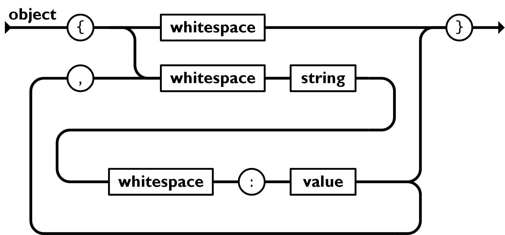
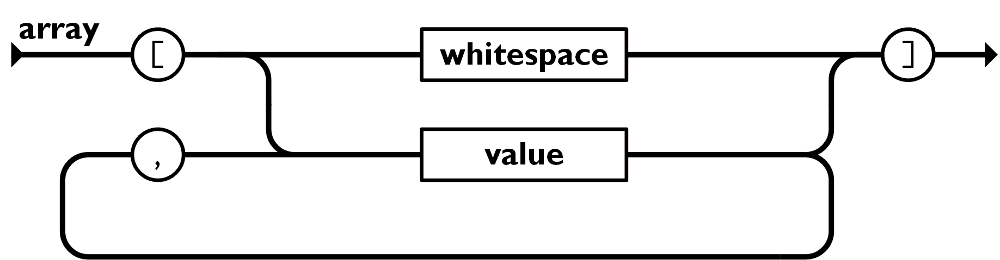
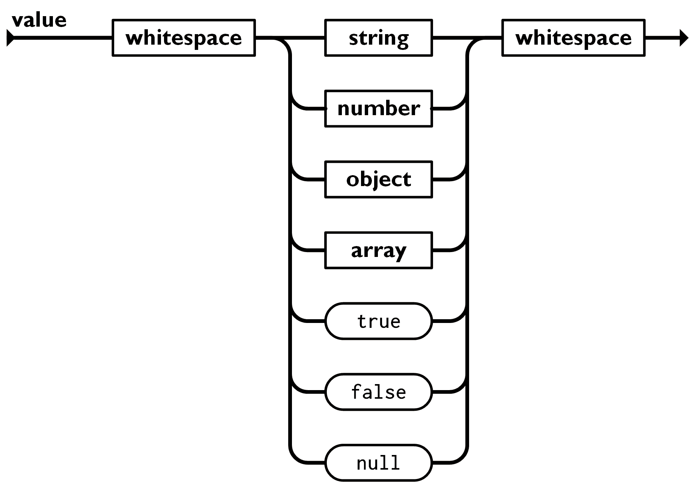

# JavaScript JSON 파서

> 이 글은 [Tan Li Hau](https://github.com/tanhauhau)가 작성한 [JSON Parser with JavaScript](https://lihautan.com/json-parser-with-javascript/)를 번역한 글입니다.

- [문법 이해하기](#문법-이해하기)
- [파서 구현하기](#파서-구현하기)
- [예상치 못한 입력 처리하기](#예상치-못한-입력-처리하기)
  - [예상치 못한 토큰](#예상치-못한-토큰)
  - [예상치 못한 문자열의 끝](#예상치-못한-문자열의-끝)
- [조금 더 나아가기](#조금-더-나아가기)
  - [에러 코드와 표준 에러 메시지](#에러-코드와-표준-에러-메시지)
  - [무엇이 잘못되었는지 더 잘 보여주기](#무엇이-잘못되었는지-더-잘-보여주기)
  - [에러 복구를 위한 제안](#에러-복구를-위한-제안)
- [요약](#요약)

Cassidoo의 주간 소식지에 실린 이번 주 인터뷰 질문은,

> 유효한 JSON 문자열을 가져와 객체(또는 선택한 언어가 사용하는 모든 것, 딕셔너리, 맵 등)로 변환하는 함수를 작성합니다.
> 입력 예제: 

```js
fakeParseJSON('{ "data": { "fish": "cake", "array": [1,2,3], "children": [ { "something": "else" }, { "candy": "cane" }, { "sponge": "bob" } ] } } ')
```

순간, 저는 그저 다음과 같이 쓰고 싶은 유혹을 받았습니다:

```js
const fakeParseJSON = JSON.parse;
```

하지만, 생각해 보니, 저는 AST<sup>[[1]](#footnote_ast)</sup>에 관한 글을 꽤 많이 써왔습니다:

- [Babel로 커스텀 JavaScript 구문 만들기](https://lihautan.com/creating-custom-javascript-syntax-with-babel/)
- [커스텀 Babel 변환 작성을 위한 단계별 가이드](https://lihautan.com/step-by-step-guide-for-writing-a-babel-transformation/)
- [JavaScript로 AST 다루기](https://lihautan.com/manipulating-ast-with-javascript/)

AST를 조작하는 방법뿐만 아니라 컴파일러 파이프라인 개요도 다루지만, 파서를 구현하는 방법에 대해서는 많이 다루지 않았습니다.

왜냐하면, JavaScript 컴파일러 구현을 글로 표현하는 것은 너무 버거운 작업이기 때문입니다.

초조해 하지 마세요.
JSON도 언어입니다.
JSON도 [스펙](https://www.json.org/json-en.html)에서 참고할 수 있는 자체 문법을 가지고 있습니다.
JSON 파서를 작성하는데 필요한 지식과 기술은 JS 파서를 작성할 때도 활용할 수 있습니다.

그럼, 이제 JSON 파서를 작성해 봅시다!

## 문법 이해하기

[스펙 문서](https://www.json.org/json-en.html)를 보면 2개의 다이어그램이 있습니다.

- 왼쪽에 [구문 다이어그램 (또는 철도 다이어그램)](https://en.wikipedia.org/wiki/Syntax_diagram)


*이미지 출처: https://www.json.org/img/object.png*

- 오른쪽에 [Backus–Naur 표기법](https://en.wikipedia.org/wiki/Backus%E2%80%93Naur_form)의 변형인, [McKeeman 표기법](https://www.crockford.com/mckeeman.html)

```
json
  element

value
  object
  array
  string
  number
  "true"
  "false"
  "null"

object
  '{' ws '}'
  '{' members '}'
```

두 다이어그램은 동일합니다.

하나는 시각적이고 하나는 텍스트 기반입니다. 텍스트 기반 문법 구문인 Backus–Naur 표기법은 보통 이 문법을 구문 분석하고 파서를 생성하는 다른 파서에 제공됩니다. 파서 개념에 대해 말하자면... 너무 복잡합니다!

이 글에서는, 철도 다이어그램에 초점을 맞출 것입니다. 왜냐하면 시각적이고 저에게 더 익숙하게 보였기 때문입니다.

첫 번째 철도 다이어그램을 살펴보겠습니다:


*이미지 출처: https://www.json.org/img/object.png*

이것이 JSON에서 **"object"** 에 대한 문법입니다.

왼쪽에서 화살표를 따라 시작하고 오른쪽에서 끝납니다.

원들은 `{`, `,`, `:`, `}`과 같은 문자이며, `whitespace`, `string`, `value`과 같은 상자들은 다른 문법의 자리를 표시합니다.
그래서 "whitespace"를 파싱하기 위해서는 **"whitespace"** 에 대한 문법을 살펴보아야 합니다.

따라서, 객체인 경우 왼쪽부터 시작해서 첫 번째 문자는 열린 괄호여야 합니다, `{`. 그리고 여기서 두 가지 옵션이 있습니다.

- `whitespace` → `}` → 종료, 또는
- `whitespace` → `string` → `whitespace` → `:` → `value` → `}` → 종료

물론, "value"에 도달하면 다음 옵션을 선택할 수 있습니다.

- → `}` → 종료, 또는
- → `,` → `whitespace` → ... → value

그리고 아래처럼 갈 때까지 계속해서 반복할 수 있습니다:
- → `}`  →  종료

그럼 이제 철도 다이어그램에 대해 잘 알고 있는 것 같네요. 다음 섹션으로 넘어가겠습니다.

## 파서 구현하기

다음과 같은 구조로 시작해 보겠습니다:

```js
function fakeParseJSON(str) {
  let i = 0;
  // TODO
}
```

`i`를 현재 문자의 인덱스로 초기화하고, `i`가 `str`의 끝에 도달하면 종료됩니다.

**"object"** 에 대한 문법을 구현해봅시다:

```js
function fakeParseJSON(str) {
  if (str[i] === '{') {
    i ++;
    skipWhitespace();

    // 만약 `}` 가 아니라면
    // string -> whitespace -> ':' -> value -> ... 경로를 가게 됩니다.
    while (str[i] !== '}') {
        const key = parseString();
        skipWhitespace();
        eatColon();
        const value = parseValue();
    }
  }
}
```

`parseObject` 에서 "string", "whitespace"와 같이 다른 문법의 구문 분석을 호출할 것이며, 그것들을 구현하면, 모든 것이 동작할 것입니다 🤞.

한 가지 깜빡한 것은 쉼표(`,`)에 대한 것입니다. `,` 는 `whitespace` → `string` → `whitespace` → :`` → ... 의 두 번째 루프를 시작하기 전 한 번만 등장합니다.

이를 기반으로 다음 행을 추가합니다:

```js
function fakeParseJSON(str) {
  let i = 0;
  function parseObject() {
    if (str[i] === '{') {
      i++;
      skipWhitespace();

      let initial = true;
      // '}' 가 아니라면
      // string -> whitespace -> ':' -> value -> ... 경로를 따라갑니다.
      while (str[i] !== '}') {
        if (!initial) {
          eatComma();
          skipWhitespace();
        }
        const key = parseString();
        skipWhitespace();
        eatColon();
        const value = parseValue();
        initial = false;
      }
      // '}'의 다음 문자로 이동합니다.
      i++;
    }
  }
}
```

몇 가지 네이밍 컨벤션:
- 문법을 기반으로 코드를 파싱하고 반환 값을 사용할 때 `parseSomething` 을 사용합니다.
- 어떤 문자가 존재하기를 예상하지만, 그 문자를 사용하지 않을 때 `eatSomething`을 사용합니다.
- 어떤 문자의 존재 여부가 상관없을 때 `skipSomething` 을 사용합니다.

`eatComma`와 `eatColon`을 구현해 봅시다:

```js
function fakeParseJSON(str) {
  // ...
  function eatComma() {
    if (str[i] !== ',') {
      throw new Error('Expected ",".');
    }
    i++;
  }

  function eatColon() {
    if (str[i] !== ':') {
      throw new Error('Expected ":".');
    }
    i++;
  }
}
```

그래서 `parseObject` 문법 구현을 완료했는데, 이 파싱 함수의 반환 값은 무엇일까요?

역시, JavaScript 객체를 반환해야 합니다:

```js
function fakeParseJSON(str) {
  let i = 0;
  function parseObject() {
    if (str[i] === '{') {
      i++;
      skipWhitespace();

      const result = {};

      let initial = true;
      // '}' 가 아니라면
      // string -> whitespace -> ':' -> value -> ... 경로를 따라갑니다.
      while (str[i] !== '}') {
        if (!initial) {
          eatComma();
          skipWhitespace();
        }
        const key = parseString();
        skipWhitespace();
        eatColon();
        const value = parseValue();
        result[key] = value;
        initial = false;
      }
      // '}' 다음 문자로 이동합니다.
      i++;

      return result;
    }
  }
}
```

이제 "object" 문법을 구현하는 것을 보았으니 "array" 문법에 도전해 볼 차례입니다.


*이미지 출처: https://www.json.org/img/array.png*

```js
function fakeParseJSON(str) {
  // ...
  function parseArray() {
    if (str[i] === '[') {
      i++;
      skipWhitespace();

      const result = [];
      let initial = true;
      while (str[i] !== ']') {
        if (!initial) {
          eatComma();
        }
        const value = parseValue();
        result.push(value);
        initial = false;
      }
      // ']' 다음 문자로 이동합니다.
      i++;
      return result;
    }
  }
}
```

이제, 조금 더 흥미로운 문법인 "value"로 넘어갑니다:


*이미지 출처: https://www.json.org/img/value.png*

value는 "whitespace"로 시작하고, "string", "number", "object", "array", "true", "false" 또는 "null" 모두 다음에 오고, "whitespace"로 끝이 납니다.

```js
function fakeParseJSON(str) {
  // ...
  function parseValue() {
    skipWhitespace();
    const value =
      parseString() ??
      parseNumber() ??
      parseObject() ??
      parseArray() ??
      parseKeyword('true', true) ??
      parseKeyword('false', false) ??
      parseKeyword('null', null);
    skipWhitespace();
    return value;
  }
}

```

`??` 은 [nullish 병합 연산자](https://developer.mozilla.org/en-US/docs/Web/JavaScript/Reference/Operators/Nullish_coalescing)인데, `||`처럼 기본값을 지정하는 데 사용하지만, `foo || default`에서  `||`는 `foo` 가 falsy 일 때 `default`를 반환하는 반면 nullish 병합 연산자는 `foo`가 `null` 또는 `undefined`일 때 `default`를 반환합니다.

parseKeyword는 현재 `str.slice(i)` 가 키워드 문자열과 일치하는지 확인하고, 일치하면 키워드 값을 반환합니다.

```js
function fakeParseJSON(str) {
  // ...
  function parseKeyword(name, value) {
    if (str.slice(i, i + name.length) === name) {
      i += name.length;
      return value;
    }
  }
}
```

여기까지 `parseValue`였습니다!

아직 3개의 문법이 더 남아 있지만, 이만 줄이고 다음의 CodeSandBox에서 구현할 것입니다: 

https://codesandbox.io/embed/json-parser-k4c3w

모든 문법을 구현한 후에, 이제 `parseValue`에 의해 반환되는 json의 값을 반환합니다.

```js
function fakeParseJSON(str) {
  let i = 0;
  return parseValue();

  // ...
}
```

바로 이겁니다!

지금까지는 모두 순조로운 부분이었습니다. 어떤 까다로운 부분들이 있을까요?

## 예상치 못한 입력 처리하기

우리는 훌륭한 개발자로서 예외 사항도 우아하게 처리할 수 있어야 합니다.
파서의 경우, 개발자에게 적절한 오류 메시지를 출력함으로써 예외 사항을 처리할 수 있습니다.

가장 일반적인 두 가지 오류 사례를 살펴보겠습니다.

- 예상치 못한 토큰
- 예상치 못한 문자열의 끝

## 예상치 못한 토큰
## 예상치 못한 문자열의 끝

모든 while 루프에서, 예를 들어 `parseObject`의 while 루프를 보면:

```js
function fakeParseJSON(str) {
  // ...
  function parseObject() {
    // ...
    while(str[i] !== '}') {
```

문자열의 길이를 벗어난 문자에 접근하지 않도록 해야 합니다.
이 문제는 문자열이 예기치 않게 종료되었을 때 발생하며, 이 예에서는 여전히 닫는 문자 "}"를 기다리고 있습니다:

```js
function fakeParseJSON(str) {
  // ...
  function parseObject() {
    // ...
    while (i < str.length && str[i] !== '}') {
      // ...
    }
    checkUnexpectedEndOfInput();

    // '}' 의 다음 문자로 이동
    i++;

    return result;
  }
}
```

## 조금 더 나아가기

여러분의 주니어 개발자 때를 기억하시나요? 암호 같은 메시지와 함께 문법 에러를 만날 때마다, 무엇이 잘못되었는지 전혀 알지 못하시진 않으셨나요?

이제 더 경험이 쌓였으니, 이 순환과 소리 지르는 것을 멈추고

```bash
Unexpected token "a"
```

사용자가 화면을 보며 당황하게 할 때입니다.

소리를 지르는 것보다 오류 메시지를 처리하는 데 더 좋은 방법이 많이 있습니다.
다음은 파서에 추가하는 것을 고려할 수 있는 몇 가지 사항입니다.

### 에러 코드와 표준 에러 메시지

이것은 사용자가 Google에 도움을 요청할 때 표준 키워드로 유용합니다.

```
// 이것보단
Unexpected token "a"
Unexpected end of input

// 이렇게 보여주세요
JSON_ERROR_001 Unexpected token "a"
JSON_ERROR_002 Unexpected end of input
```

### 무엇이 잘못되었는지 더 잘 보여주기

Babel과 같은 파서는, 코드 프레임을 보여줍니다.
코드 프레임은 밑줄, 화살표 또는 잘못된 부분이 강조 표시된 코드의 일부분입니다.

```bash
// 이것보단
Unexpected token "a" at position 5

// 이렇게 보여주세요
{ "b"a
      ^
JSON_ERROR_001 Unexpected token "a"
```

코드의 일부분을 출력하는 방법에 대한 예:

```js
function fakeParseJSON(str) {
  // ...
  function printCodeSnippet() {
    const from = Math.max(0, i - 10);
    const trimmed = from > 0;
    const padding = (trimmed ? 3 : 0) + (i - from);
    const snippet = [
      (trimmed ? '...' : '') + str.slice(from, i + 1),
      ' '.repeat(padding) + '^',
      ' '.repeat(padding) + message,
    ].join('\n');
    console.log(snippet);
  }
}
```

### 에러 복구를 위한 제안

가능하다면, 무엇이 잘못되었는지 설명하고 해결 방법을 제안하세요.

```bash
// 이것보단
Unexpected token "a" at position 5

// 이렇게 보여주세요
{ "b"a
      ^
JSON_ERROR_001 Unexpected token "a".
Expecting a ":" over here, eg:
{ "b": "bar" }
      ^
You can learn more about valid JSON string in http://goo.gl/xxxxx
```

가능하면, 파서가 지금까지 수집한 컨텍스트를 기반으로 제안을 제공하세요.

```bash
fakeParseJSON('"Lorem ipsum');

// 이것보단
Expecting a `"` over here, eg:
"Foo Bar"
        ^

// 이렇게 보여주세요
Expecting a `"` over here, eg:
"Lorem ipsum"
            ^
```

컨텍스트를 바탕으로 한 제안은 더 공감되고 실행할 수 있는 것처럼 느껴질 것입니다.

다음 모든 제안 사항을 염두에 두고 업데이트된 CodeSandBox를 확인하세요.

- 의미 있는 에러 메시지
- 실패 지점의 에러를 가리키는 코드 스니펫
- 에러 복구에 대한 제안 제공

https://codesandbox.io/embed/json-parser-hjwxk

또한, Elm이 어떻게 Elm 컴파일러의 UX 문제를 개선하는지에 대한 [Evan Czaplicki](https://twitter.com/czaplic)의 [사람을 위한 컴파일러 에러](https://elm-lang.org/news/compiler-errors-for-humans)를 읽어보세요.

## 요약

파서를 구현하기 위해서는 문법부터 시작해야 합니다.

철도 다이어그램이나 Backus-Naur 표기법으로 문법을 공식화할 수 있습니다.
문법을 설계하는 것이 가장 어려운 단계입니다.

문법에 익숙해지면, 이를 기반으로 파서 구현을 시작할 수 있습니다.

에러 처리가 중요하며, 더 중요한 것은 사용자가 에러 메시지를 수정하는 방법을 알 수 있도록 의미 있는 에러 메시지를 사용하는 것입니다.

이제 간단한 파서가 어떻게 구현되는지 알았으니, 좀 더 복잡한 파서를 살펴봐야 할 때입니다. 

- [Babel 파서](https://github.com/babel/babel/tree/master/packages/babel-parser)
- [Svelte 파서](https://github.com/sveltejs/svelte/tree/master/src/compiler/parse)

마지막으로, [@cassidoo](https://twitter.com/cassidoo)를 팔로우하세요. 그녀의 주간 소식지는 굉장합니다!

---

1. <a name="footnote_ast">AST</a>: Abstract Syntax Tree의 약자로 소스 코드를 분석해 트리 형태로 나타낸 데이터 구조이다.
