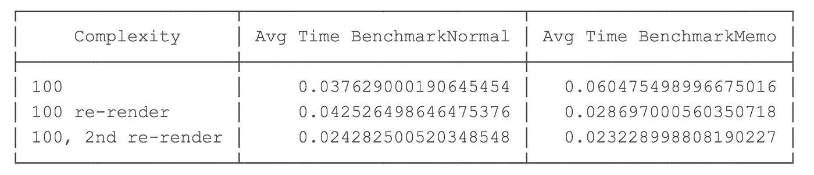
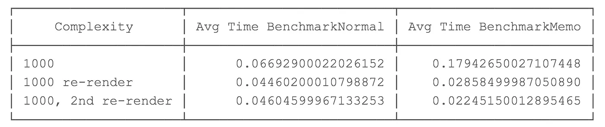
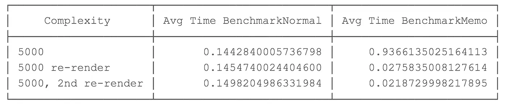

# 정말 리액트에서 useMemo를 사용해야 할까요? 알아봅시다.

> 원문: https://medium.com/swlh/should-you-use-usememo-in-react-a-benchmarked-analysis-159faf6609b7

최근 몇몇 개발자가 리액트에서 *useMemo*를 언제 사용해야 하느냐는 질문을 했습니다.
좋은 질문입니다.
이 글에서는 과학적인 접근법으로, 가설을 정의한 다음, 리액트의 실제 벤치마크로 이를 테스트해 보겠습니다.

useMemo가 성능에 미치는 영향이 궁금하다면 계속 읽어보세요.

## useMemo 란?

[useMemo](https://reactjs.org/docs/hooks-reference.html#usememo)는 리액트에서 제공하는 훅 중에 하나입니다.
이 훅을 사용하면 개발자가 종속성 목록에 따라 변수의 값을 캐시 할 수 있습니다.
종속성 목록의 변수가 변경되면 리액트는 이 데이터에 대한 처리를 다시 실행하고 캐시 합니다.
종속성 목록의 변숫값이 이전에 캐시된 적이 있으면 리액트는 캐시에서 값을 가져옵니다.

이는 주로 컴포넌트 리렌더링에 영향을 미칩니다.
컴포넌트가 다시 렌더링 되면 배열을 반복하거나 데이터를 처리할 필요 없이 캐시에서 값을 가져옵니다.

## 리액트에서는 useMemo에 대해 뭐라고 하나요?

[useMemo에 대한 리액트 문서](https://reactjs.org/docs/hooks-reference.html#usememo)를 보면 언제 사용해야 하는지에 대한 언급이 없습니다.
단순히 기능과 사용 방법에 대해 언급하고 있습니다.

> 성능 최적화를 위해 `useMemo`를 사용할 수 있습니다.

여기서 궁금한 점은 어느 시점부터 useMemo가 흥미롭냐는 것입니다.
useMemo를 사용할 때 성능 이점을 얻으려면 데이터가 얼마나 복잡하거나 커야 할까요?
개발자들은 실제로 언제 useMemo를 사용해야 할까요?

## 가설

실험을 시작하기 전에 가설을 정의해 보겠습니다.

먼저 **처리하고자 하는 객체와 처리의 복잡도**를 n으로 정의합니다.
n = 100 이면, 캐시된 변수의 최종값을 얻기 위해 100개의 항목 배열을 반복해야 합니다.

그다음 두 액션을 분리해야 합니다.
첫 번째 액션은 컴포넌트의 **초기 렌더링**입니다.
이 경우 변수가 useMemo를 사용하는지에 관계없이 초깃값을 계산해야 합니다.
첫 번째 렌더링이 완료되면 useMemo를 사용한 **후속 리렌더링**(측정해야 하는 두 번째 작업)에서는 캐시에서 값을 찾을 수 있으며, 이 경우 캐시 하지 않은 버전 대비 성능 이점을 볼 수 있습니다.

모든 경우에서, 초기 렌더링 시에 캐시를 설정하고 값을 저장하기 위해 약 5-10%의 오버헤드가 예상됩니다.
n < 1000 미만일 때 useMemo로 인한 성능 저하를 예상합니다.
n > 1000인 경우, useMemo를 사용하여 리렌더링에서 유사하거나 더 나은 성능을 기대할 수 있지만 추가 캐싱 알고리즘으로 인해 초기 렌더링은 여전히 약간 느려질 수 있습니다.
당신의 가설은 무엇입니까?

## 벤치마크 셋업

다음과 같이 작은 리액트 컴포넌트를 만들었습니다. 설명한 대로 복잡성 n을 가진 객체를 생성하며 복잡성은 _level_ 프로퍼티로 정의됩니다.

```jsx
import React from 'react';
const BenchmarkNormal = ({level}) => {
    const complexObject = {
        values: []
    };
    for (let i = 0; i <= level; i++) {
        complexObject.values.push({ 'mytest' });
    }
    return ( <div>Benchmark level: {level}</div>);
};
export default BenchmarkNormal;
```

이는 일반적인 벤치마크 컴포넌트이며 `useMemo`를 사용한 BenchmarkMemo 컴포넌트도 만들 것입니다.

```jsx
import React, {useMemo} from 'react';
const BenchmarkMemo = ({level}) => {
    const complexObject = useMemo(() => {
        const result = {
            values: []
        };

        for (let i = 0; i <= level; i++) {
            result.values.push({'mytest'});
        };
        return result;
    }, [level]);
    return (<div>Benchmark with memo level: {level}</div>);
};
export default BenchmarkMemo;
```

그런 다음 버튼을 누를 때 컴포넌트가 표시되도록 App.js에 설정합니다.
또한 리액트의 `<Profiler>`을 사용해 렌더링 시간을 제공합니다.

```jsx
function App() {
  const [showBenchmarkNormal, setShowBenchmarkNormal] = useState(false);
  // 이 컴포넌트를 렌더링 하는 횟수를 지정하며
  // 그리고 이런 모든 렌더링에 대한 평균 렌더링 시간을 계산합니다.
  const timesToRender = 10000;
  // profiler 콜백
  const renderProfiler = (type) => {
    return (...args) => {
      // 렌더링 시간을 배열로 유지합니다.
      // 나중에 평균 시간을 계산합니다.
      // 렌더링 시간인 args[3]을 저장합니다.
    };
  };
  // 컴포넌트를 렌더링합니다.
  return (
    <p>
      {showBenchmarkNormal &&
        [...Array(timesToRender)].map((index) => {
          return (
            <Profiler
              id={`normal-${index}`}
              onRender={renderProfiler("normal")}
            >
              <BenchmarkNormal level={1} />
            </Profiler>
          );
        })}
    </p>
  );
}
```

보시다시피 컴포넌트를 10,000번 렌더링하고 이에 대한 평균 렌더링 시간을 가져옵니다.
그리고 useMemo를 재계산할 필요 없이 필요할 때마다 컴포넌트를 다시 렌더링할 수 있는 메커니즘이 필요합니다. 그러려면 useMemo의 종속성 목록에 있는 어떤 값도 수정하지 않아야 합니다.

```jsx
// state에 간단한 카운터를 추가합니다.
// 이는 리렌더링을 발생하기 위해 사용됩니다.
const [count, setCount] = useState(0);
const triggerReRender = () => {
  setCount(count + 1);
};
// 추가적인 prop를 가지도록 벤치마크 컴포넌트를 업데이트 합니다.
// 강제로 리렌더링 됩니다.
<BenchmarkNormal level={1} count={count} />;
```

결과를 깔끔하게 유지하기 위해서, 테스트를 시작하기 전에 항상 브라우저 새 웹페이지로 시작(리렌더링 제외)하여 페이지에 남아 결과에 영향을 줄 수 있는 캐시를 모두 정리합니다.

## 결과

### 복잡도 n = 1 결과


복잡도는 왼쪽 열에 표시되며 첫 번째 테스트는 초기 렌더링, 두 번째 테스트는 첫 번째 리 렌더링, 마지막 테스트는 두 번째 리렌더링 입니다.
두 번째 열은 useMemo를 사용하지 않은 일반 벤치마크 결과입니다.
마지막 열은 useMemo를 사용한 벤치마크 결과입니다.
이 값들은 벤치마크 컴포넌트의 10,000 번 렌더링의 평균 렌더링 시간입니다.

useMemo를 사용할 때 초기 렌더링은 19% 느려지며 예상치인 5-10% 보다 훨씬 높습니다.
후속 렌더링은 useMemo 캐시를 통과하는 데 든 오버헤드가 실제 값을 재계산하는 것보다 더 비용이 들기 때문에 여전히 느립니다.

결론적으로 복잡성이 n=1일 경우 오버헤드가 항상 성능보다 크기 때문에 useMemo를 사용하지 않는 것이 항상 빠릅니다.

### 복잡도 n = 100 결과




복잡도가 100이면, useMemo를 사용한 초기 렌더링은 62% 느려지는데 이는 상당한 크기입니다.
후속 렌더링은 평균적으로 약간 빠르거나 유사한 것으로 보입니다.

결론적으로, 100의 복잡도에서, 초기 렌더링은 상당히 느리지만, 후속 리렌더링은 거의 유사하고 기껏해야 조금 더 빠른 정도입니다.
이 시점에서, useMemo가 아직 흥미로워 보이지는 않습니다.

### 복잡도 n = 1000 결과




복잡도가 1000 이면 useMemo를 사용한 초기 렌더링이 183% 느려지는 것을 볼 수 있습니다.
아마도 useMemo 캐시가 값을 저장하기 위해 더 열심히 일하고 있을 것입니다.
후속 렌더링은 약 37% 더 빠릅니다!

이 시점에서, 리렌더링 하는 동안 약간의 성능 향상을 볼 수 있지만 공짜는 아닙니다.
초기 렌더링은 183%의 시간 손실로 훨씬 느려집니다.

**결론적으로**, 복잡도가 1000인 경우 초기 렌더링 동안 더 큰 성능 손실(183%)을 볼 수 있지만 이후 렌더링은 약 37% 더 빠릅니다.

이것이 이미 흥미로운지 아닌지는 사용 사례에 따라 크게 달라집니다.
초기 렌더링 중에 183%의 성능 손실은 납득하기 어렵지만 컴포넌트에서 리렌더링이 많은 경우에는 정당화할 수 있습니다.

### 복잡도 n = 5000 결과




복잡도가 5000인 경우 useMemo를 사용하면 초기 렌더링 속도가 545% 느려집니다.
데이터 처리가 복잡할수록 초기 렌더링은 useMemo가 없는 것에 비해 느려집니다.

후속 렌더링을 보면 흥미롭습니다. useMemo를 사용한 경우 후속 렌더링마다 성능이 437%에서 609%까지 향상합니다.

**결론적으로** 초기 렌더링 비용은 useMemo를 사용하면 훨씬 더 비싸지만, 후속 리렌더링에서는 훨씬 더 큰 성능 향상을 보입니다.
여러분의 애플리케이션이 복잡도 > 5000 이상인 데이터/처리를 가지고 있고 어느 정도 리렌더링이 발생하는 경우 useMemo를 사용하는 것의 이점을 볼 수 있습니다.

## 결과에 대한 참고 사항

친절한 독자 커뮤니티가 초기 렌더링이 훨씬 느려질 수 있는 이유에 대해 프로덕션 모드 실행과 같은 몇 가지 이유를 지적했습니다.
우리는 모든 실험을 다시 했고 결과가 비슷하다는 것을 알게 되었습니다.
비율은 비슷하지만 실제 값은 더 낮을 수 있습니다.
모든 결론이 동일하게 적용됩니다.

## 결론


애플리케이션이 배열에 값을 n번 반복하여 추가하는 복잡도 n의 값을 가진 컴포넌트를 사용한 결과입니다.
**결과는 데이터의 양과 데이터를 어떻게 처리하는지에 따라 달라질 수 있다는 점에 유의하세요.**
하지만 데이터의 크기에 따른 성능 차이를 대략 파악할 수 있습니다

사용 사례에 따라 크게 달라지겠지만, 복잡도가 100 미만인 경우 useMemo는 별로 흥미로워 보이지 않습니다.
초기 성능 손실은 약 5~10% 정도일 것으로 예상했지만, 데이터/처리 복잡성에 따라 크게 달라지며 심지어 예상보다 100배나 많은 500%의 성능 손실이 발생할 수도 있다는 사실을 발견했습니다.
결과가 나온 후에도 테스트를 몇 번 다시 실행했으며, 이후 결과는 일관되었고 처음 기록했던 결과와 유사했습니다.

## 핵심

useMemo는 변수의 동일한 객체 참조를 유지해서 **불필요한 리렌더링을 피하는 데** 유용하다는 것은 모두들 동의할 것입니다.

useMemo를 사용해 실제 계산을 캐시하는 경우에는, 주요 목표가 하위 컴포넌트에서 리렌더링을 피하는 것이 아닙니다:

- useMemo는 처리량이 많을 때 사용해야 합니다.
- 추가 처리를 피하려고 useMemo를 사용하는 것이 흥미로워지는 임곗값은 애플리케이션에 따라 크게 달라집니다.
- 처리량이 매우 적은 경우 useMemo를 사용하면 추가 오버헤드가 발생할 수 있습니다.

언제 useMemo를 사용하시나요?
이번 조사 결과로 언제 사용해야 할지에 대한 생각이 바뀌셨나요?
댓글로 알려주세요!
