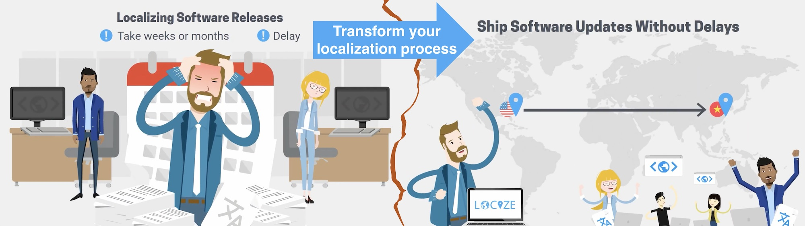

# Next.js에서 i18n과 호환성을 갖춘 정적 HTML Export

> 원문: https://locize.com/blog/next-i18n-static/


[Next.js](https://nextjs.org/)에 대해선 아시나요? - 모르신다면 이 글을 읽지 마시고 다른 것을 만들어 보세요.

_Next.js 13과 app 디렉터리를 사용 중이라면 [이 블로그 글](https://locize.com/blog/next-13-app-dir-i18n/)을 확인해 보세요._

Next.js는 굉장합니다! 필요한 모든 기능을 갖춘 최고의 개발자 경험을 제공합니다.

## TOC

- 하지만, 이미 들어보셨을 수도 있습니다.
- 이제 어떻게 하면 좋을까요?
- 레시피
- 결과
- 🎉🥳 축하합니다 🎊🎁

## 하지만, 이 문제를 겪어보셨을 겁니다.

```
Error: i18n support is not compatible with next export. See here for more info on deploying: https://nextjs.org/docs/deployment
```

[국제화 라우팅 기능](https://nextjs.org/docs/pages/building-your-application/routing/internationalization)을 사용 중이고 `next export`를 실행해서 [정적 HTML export](https://nextjs.org/docs/pages/building-your-application/deploying/static-exports)를 생성하려는 경우 이 문제가 발생합니다.
하지만 이 기능은 빌드 프로세스 중에 계산할 수 없는 동적 로직 또는 Node.js 서버가 필요하기 때문에 [지원되지 않습니다](https://nextjs.org/docs/pages/building-your-application/deploying/static-exports#unsupported-features).

예를 들어 [next-i18next](https://github.com/i18next/next-i18next)를 사용하는 것이 이 경우에 해당합니다.

## 이제 어떻게 하면 좋을까요?


확실한 대안은 정적 HTML export를 포기하고 배포 환경으로 Node.js 서버 또는 Vercel을 사용하는 것입니다.

하지만 회사 또는 아키텍처 가이드라인에 따라 정적 웹 서버를 사용해야 하는 경우도 있습니다.
그럼 i18n을 버려야 하나요? - 아니요, 지금 이 글을 읽고 있다면 이는 필수사항인 것 같습니다.
그럼 Next.js 없이 해야 하나요? - 하지만 이건 모든 프로젝트를 다시 작성하는 것을 뜻합니다.

i18n을 사용하지 않을 때 `next export` 를 실행하면 잘 동작하는 것 같습니다. [국제화 라우팅 기능](https://nextjs.org/docs/pages/building-your-application/routing/internationalization)을 사용하지 않고 i18n 라우팅을 우리가 직접 수행하면 어떨까요?

## 레시피

이 레시피를 "요리"하려면 다음 재료가 필요합니다.

- [동적 경로 세그먼트](https://nextjs.org/docs/pages/building-your-application/routing#dynamic-route-segments) 기능 사용
- 프로젝트 파일의 구조를 변경하려는 의지
- 약간의 코드를 수정하려는 의지
- 사용자 언어를 감지하고 그에 따라 리다이렉션하는 로직

할만하겠군요. 시작하겠습니다.

### 1. `next.config.js`에서 i18n 옵션을 제거합니다.

```diff
- const { i18n } = require('./next-i18next.config')
-
module.exports = {
-   i18n,
  trailingSlash: true,
}
```

### 2. `[locale]` 폴더를 pages 디렉터리에 생성합니다.

a\) 모든 페이지 파일을 해당 폴더로 옮깁니다. (\_app.js 또는 \_document.js는 제외)

b\) 필요한 경우 import를 조정합니다.

### 3. `getStatic.js`파일을 생성하고 `lib` 디렉터리에 위치시킵니다.

```js
import { serverSideTranslations } from "next-i18next/serverSideTranslations";
import i18nextConfig from "../next-i18next.config";

export const getI18nPaths = () =>
  i18nextConfig.i18n.locales.map((lng) => ({
    params: {
      locale: lng,
    },
  }));

export const getStaticPaths = () => ({
  fallback: false,
  paths: getI18nPaths(),
});

export async function getI18nProps(ctx, ns = ["common"]) {
  const locale = ctx?.params?.locale;
  let props = {
    ...(await serverSideTranslations(locale, ns)),
  };
  return props;
}

export function makeStaticProps(ns = {}) {
  return async function getStaticProps(ctx) {
    return {
      props: await getI18nProps(ctx, ns),
    };
  };
}
```

### 4.페이지들에서 `getStaticPaths` 와 `makeStaticProps`를 다음과 같이 사용합니다.

```diff
import { useTranslation } from 'next-i18next'
import { getStaticPaths, makeStaticProps } from '../../lib/getStatic'
import { Header } from '../../components/Header'
import { Footer } from '../../components/Footer'
import Link from '../../components/Link'

+ const getStaticProps = makeStaticProps(['common', 'footer'])
+ export { getStaticPaths, getStaticProps }

const Homepage = () => {
  const { t } = useTranslation('common')

  return (
    <>
      <main>
        <Header heading={t('h1')} title={t('title')} />
        <div>
          <Link href='/second-page'><button type='button'>{t('to-second-page')}</button></Link>
        </div>
      </main>
      <Footer />
    </>
  )
}

export default Homepage
```

### 5. [next-language-detector](https://github.com/i18next/next-language-detector)를 설치합니다.

`npm i next-language-detector`

### 6. `languageDetector.js`파일을 생성하고 `lib` 디렉터리에 위치시킵니다.

```js
import languageDetector from "next-language-detector";
import i18nextConfig from "../next-i18next.config";

export default languageDetector({
  supportedLngs: i18nextConfig.i18n.locales,
  fallbackLng: i18nextConfig.i18n.defaultLocale,
});
```

### 7. `redirect.js` 파일을 생성하고 `lib` 디렉터리에 위치시킵니다.

```js
import { useEffect } from "react";
import { useRouter } from "next/router";
import languageDetector from "./languageDetector";

export const useRedirect = (to) => {
  const router = useRouter();
  to = to || router.asPath;

  // 언어 감지
  useEffect(() => {
    const detectedLng = languageDetector.detect();
    if (to.startsWith("/" + detectedLng) && router.route === "/404") {
      // 무한 루프 방지
      router.replace("/" + detectedLng + router.route);
      return;
    }

    languageDetector.cache(detectedLng);
    router.replace("/" + detectedLng + to);
  });

  return <></>;
};

export const Redirect = () => {
  useRedirect();
  return <></>;
};

// eslint-disable-next-line react/display-name
export const getRedirect = (to) => () => {
  useRedirect(to);
  return <></>;
};
```

### 8. `index.js`를 제외한 `[locale]` 디렉터리의 모든 페이지 파일들과 동일한 파일 이름으로 아래 내용의 파일들을 생성합니다.

```js
import { Redirect } from "../lib/redirect";
export default Redirect;
```

### 9. `Link.js` 컴포넌트를 생성해서 `components` 디렉터리에 위치시킵니다.

```jsx
import React from "react";
import Link from "next/link";
import { useRouter } from "next/router";

const LinkComponent = ({ children, skipLocaleHandling, ...rest }) => {
  const router = useRouter();
  const locale = rest.locale || router.query.locale || "";

  let href = rest.href || router.asPath;
  if (href.indexOf("http") === 0) skipLocaleHandling = true;
  if (locale && !skipLocaleHandling) {
    href = href
      ? `/${locale}${href}`
      : router.pathname.replace("[locale]", locale);
  }

  return (
    <>
      <Link href={href}>
        <a {...rest}>{children}</a>
      </Link>
    </>
  );
};

export default LinkComponent;
```

### 10. 모든 `next/link` `Link` import 를 `../components/Link` `Link` import로 교체합니다.

```diff
- import Link from 'next/link'
+ import Link from '../../components/Link'
```

### 11. 올바른 html `lang` 속성으로 설정하기 위해 `_document.js` 파일을 추가하거나 수정합니다.

```tsx
import Document, { Html, Head, Main, NextScript } from "next/document";
import i18nextConfig from "../next-i18next.config";

class MyDocument extends Document {
  render() {
    const currentLocale =
      this.props.__NEXT_DATA__.query.locale || i18nextConfig.i18n.defaultLocale;
    return (
      <Html lang={currentLocale}>
        <Head />
        <body>
          <Main />
          <NextScript />
        </body>
      </Html>
    );
  }
}

export default MyDocument;
```

### 12. 언어 변경 기능이 있는 경우, 아래와 같이 생성하고 이를 적용합니다.

```jsx
// components/LanguageSwitchLink.js
import languageDetector from "../lib/languageDetector";
import { useRouter } from "next/router";
import Link from "next/link";

const LanguageSwitchLink = ({ locale, ...rest }) => {
  const router = useRouter();

  let href = rest.href || router.asPath;
  let pName = router.pathname;
  Object.keys(router.query).forEach((k) => {
    if (k === "locale") {
      pName = pName.replace(`[${k}]`, locale);
      return;
    }
    pName = pName.replace(`[${k}]`, router.query[k]);
  });
  if (locale) {
    href = rest.href ? `/${locale}${rest.href}` : pName;
  }

  return (
    <Link href={href} onClick={() => languageDetector.cache(locale)}>
      <button style={{ fontSize: "small" }}>{locale}</button>
    </Link>
  );
};

export default LanguageSwitchLink;
```

```jsx
// components/Footer.js
import { useTranslation } from "next-i18next";
import { useRouter } from "next/router";
import LanguageSwitchLink from "./LanguageSwitchLink";
import i18nextConfig from "../next-i18next.config";

export const Footer = () => {
  const router = useRouter();
  const { t } = useTranslation("footer");
  const currentLocale = router.query.locale || i18nextConfig.i18n.defaultLocale;

  return (
    <footer>
      <p>
        <span style={{ lineHeight: "4.65em", fontSize: "small" }}>
          {t("change-locale")}
        </span>
        {i18nextConfig.i18n.locales.map((locale) => {
          if (locale === currentLocale) return null;
          return <LanguageSwitchLink locale={locale} key={locale} />;
        })}
      </p>
    </footer>
  );
};
```

## 결과


이제 프로젝트를 시작하면(`next dev`) 이전과 거의 동일한 동작을 볼 수 있습니다.

그렇다면 어떤 이점이 있을까요?

`next build && next export`를 시도해 보세요.

마지막에 다음과 같은 내용이 표시됩니다.

```
●  (SSG)     automatically generated as static HTML + JSON (uses getStaticProps)

info  - using build directory: /Users/usr/projects/my-awesome-project/.next
info  - Copying "static build" directory
info  - No "exportPathMap" found in "/Users/usr/projects/my-awesome-project/next.config.js". Generating map from "./pages"
info  - Launching 9 workers
info  - Copying "public" directory
info  - Exporting (3/3)
Export successful. Files written to /Users/usr/projects/my-awesome-project/out
```

**네, `i18과 호환되지 않는다는 next export` 에러가 더 이상 없습니다!**

**축하합니다. 이제 `out` 디렉터리의 콘텐츠를 정적 웹서버에 "배포"할 수 있습니다.**

🧑‍💻 완성된 코드는 [이곳](https://github.com/i18next/next-language-detector/tree/main/examples/basic)에서 확인할 수 있습니다.

## 자발적인 부분



멋진 번역 관리 시스템에 연결해서 코드 외부에서 번역을 관리하세요.

[locize](https://locize.com/)를 통해 번역 파일을 동기화해 보겠습니다.
이 작업은 온-디맨드 또는 CI서버에서 수행하거나 앱을 배포하기 전에 수행할 수 있습니다.

### 이 단계에 도달하기 위해 수행해야 할 작업:

1. locize에서: https://locize.app/register에 가입하고 [로그인](https://docs.locize.com/integration/getting-started/create-a-user-account)합니다.
1. locize에서: [프로젝트를 생성합니다.](https://docs.locize.com/integration/getting-started/add-a-new-project)
1. locize에서: 모든 추가 언어를 추가합니다.([API](https://docs.locize.com/integration/api#add-new-language)로도 가능합니다)
1. [lociz-cli](https://github.com/locize/locize-cli)를 설치합니다 (`npm i locize-cli`)

### [locize-cli](https://github.com/locize/locize-cli) 사용.

`locize sync` 명령어를 사용해서 로컬 저장소(`public/locales`) 와 locize에 배포된 것을 동기화 시킵니다.

또는 `locize download` 명령을 사용하여 앱을 번들링하기 전에 게시된 locize 번역을 로컬 저장소(`public/locales`)에 다운로드할 수도 있습니다.

## 🎉🥳 축하합니다 🎊🎁

정적 사이트 생성(SSG), [Next.js](https://nextjs.org/), [next-i18next](https://github.com/i18next/next-i18next), [i18next](https://www.i18next.com/) 및 [최신 국제화 워크플로우](https://locize.com/)에 대해 몇가지 새로운 사실을 알게 되셨기를 바랍니다.

따라서 i18n 주제를 한 단계 더 발전시키고 싶다면 [국제화 관리 플랫폼인 locize](https://locize.com/)를 사용해볼 가치가 있습니다.

[locize](https://locize.com/)의 창립자는 [i18next](https://www.i18next.com/)의 제작자이기도 합니다. 따라서 [locize](https://locize.com/)를 사용하면 i18next의 미래를 직접 지원할 수 있습니다.

## 최적화된 Next.js 번역 셋업을 찾고 계신가요?


[여기](https://locize.com/blog/next-i18next/)에서 클라이언트 측 번역 다운로드 및 SEO 최적화와 함께 next-i18next를 가장 효과적으로 사용하는 방법에 대한 블로그 게시물을 확인할 수 있습니다.
