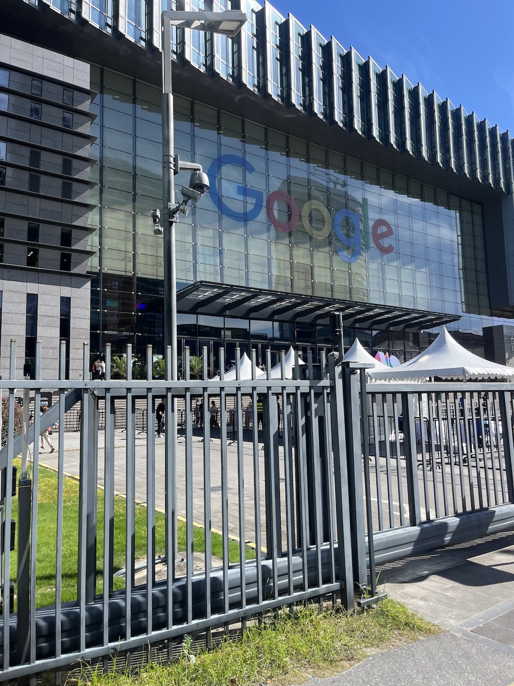
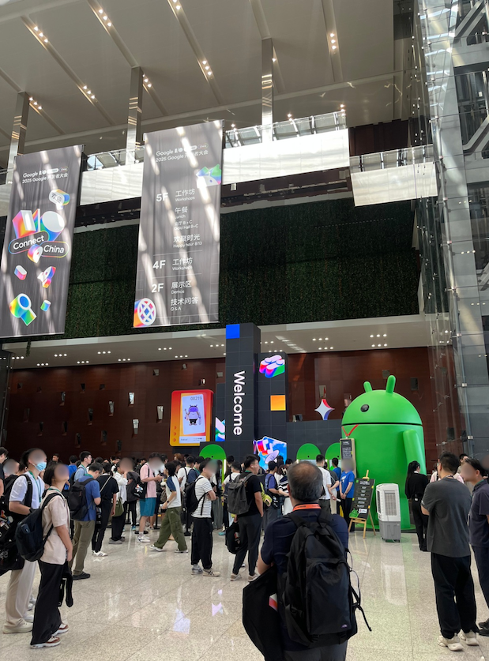
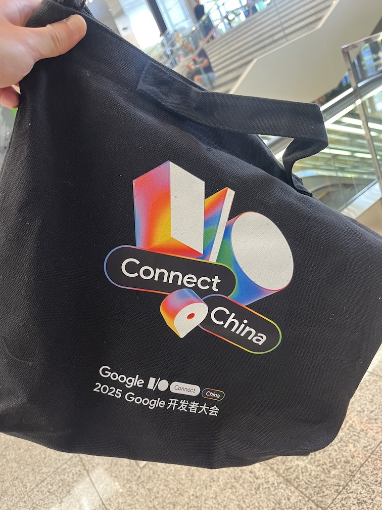
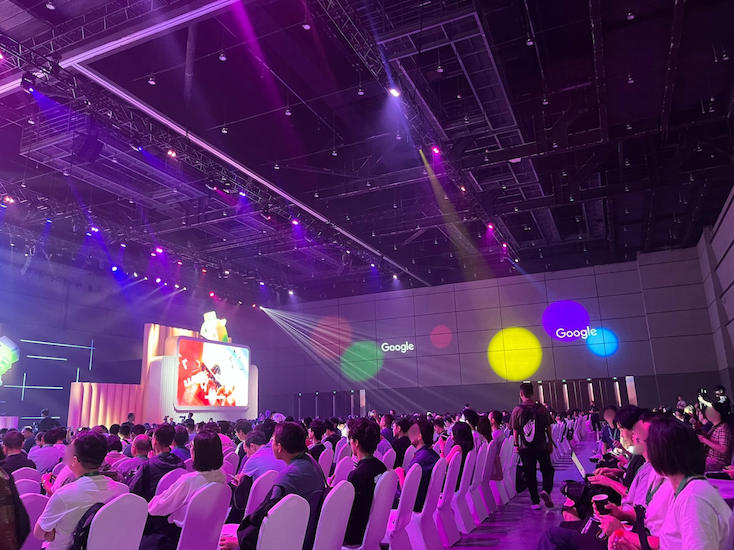
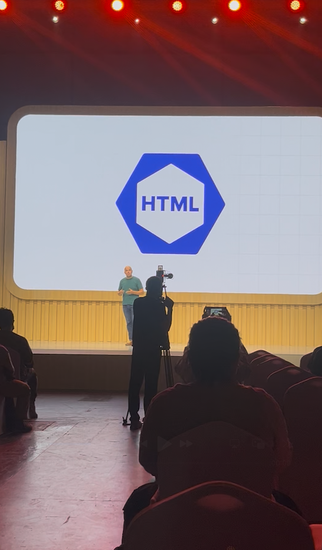
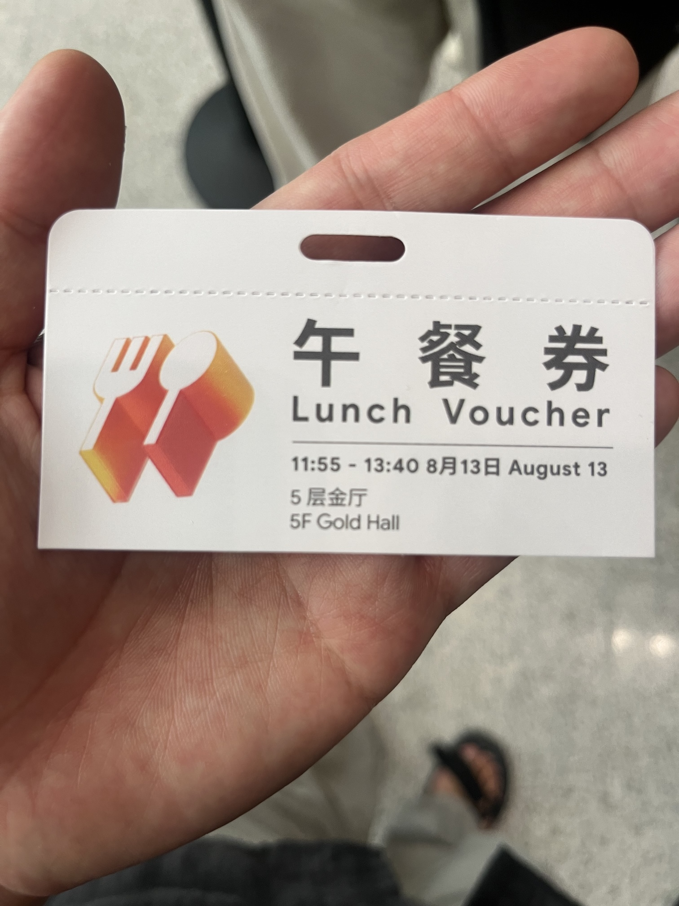
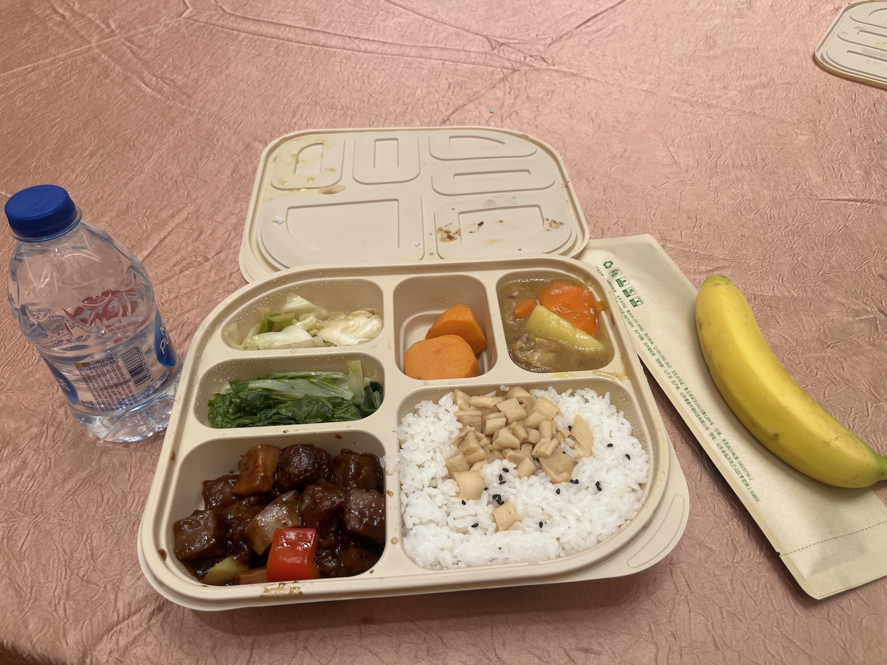
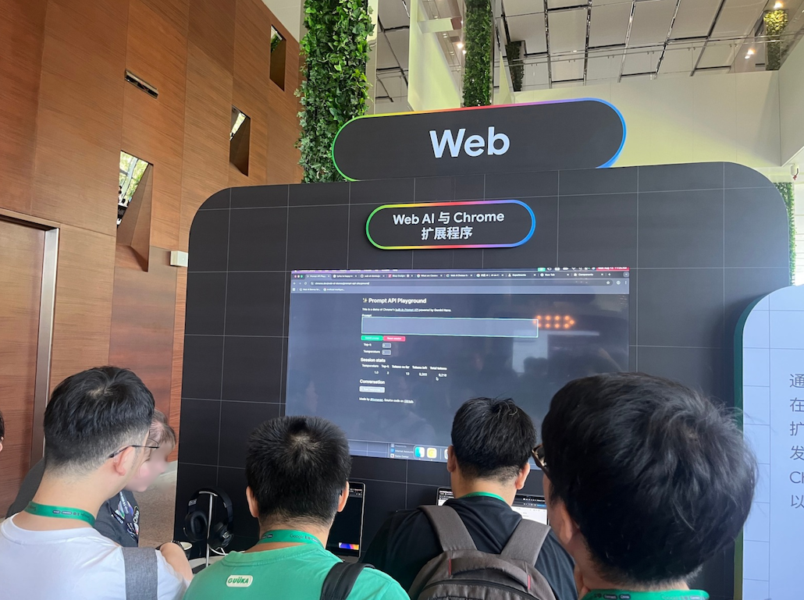
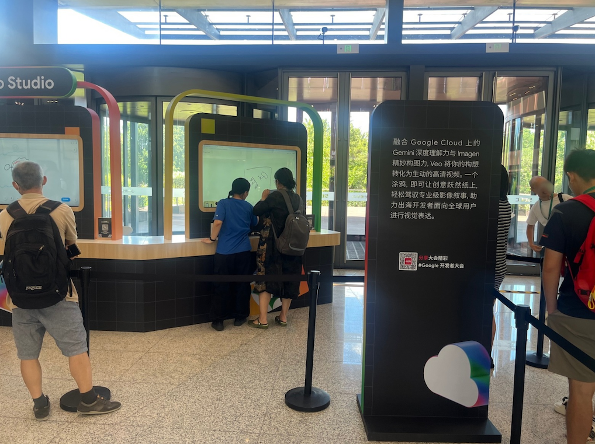

# Google I/O Connect China 2025 참여 후기

이 글은 2025 년 8월 13~14일에 개최한 Google I/O Connect China에 초대받아 참여한 후기를 작성한 글입니다. 처음 참여한 해외 컨퍼런스를 기억하기 위해 글을 남깁니다.

## Google I/O Connect 란?

Google I/O Connect는 Google이 전 세계 주요 도시에서 개최하는 개발자 컨퍼런스입니다. Google I/O 본 행사에서 발표된 최신 기술과 제품을 현지 개발자들에게 소개하고, 지역 커뮤니티와 함께 Google의 기술 생태계를 공유하는 자리입니다.

## 어떻게 참여하게 되었는가

저는 [html-eslint](https://github.com/yeonjuan/html-eslint)라는 오픈소스 프로젝트를 운영하고 있습니다. [Baseline](https://web.dev/baseline)이라는 웹 기술의 호환성 기준선을 html-eslint 규칙으로 지원해달라는 [제안](https://github.com/yeonjuan/html-eslint/issues/308)을 받았고, 이를 [use-baseline](https://html-eslint.org/docs/rules/use-baseline) 구현했습니다.

이후 Google I/O Connect에서 Baseline을 소개하는 세션에 html-eslint도 함께 해도 되겠냐는 연락을 받았고, 덕분에 이번 행사에 초대받아 참여하게 되었습니다.

## 현장

행사는 상하이 국제 엑스포 센터에서 열렸습니다. 너무 더운 날씨 때문에 주변을 돌아다니기가 어려웠습니다.

내부 홀에서 등록을 완료하면 굿즈를 받을 수 있었습니다.

발표홀은 2개로 나뉘어 있었고, 여러 세션 중에서 선택해서 들을 수 있었습니다. 저는 주로 웹 관련 세션을 선택해서 들었습니다. 발표는 중국어나 영어로 진행되었는데, 중국어 발표의 경우 통역기를 통해 들을 수 있었지만 모든 내용을 완벽히 이해하기는 다소 어려웠습니다.

Baseline 세션에서 HTML-ESLint가 잠깐 소개되었습니다. 제가 만든 로고가 Google 발표 자료에 나오는 걸 보니 신기하고 뿌듯했습니다.

점심시간에는 등록할 때 받은 런치 바우처로 식사를 했습니다. 아쉽게도 음식이 입맛에 잘 맞지는 않았습니다.

점심시간 이후에는 윗층에 마련된 체험 부스를 둘러봤습니다. Google에서 개발 중이거나 새롭게 출시한 제품들을 직접 확인하고 체험해 볼 수 있는 좋은 기회였습니다.

## 후기

오픈소스 활동을 하다가 예상치 못하게 Google I/O Connect에 초대받아 참여하게 되어 정말 좋은 경험이었습니다. 혼자서 작은 오픈소스 프로젝트를 하다보면 성취감을 느끼기 어려운 것 같은데. 제가 만든 프로젝트가 Google의 공식 행사에서 소개되는 것을 직접 보는 것은 큰 보람을 느낄 수 있는 순간이었습니다.

처음 참여한 해외 컨퍼런스였기에 설레기도 하고 긴장도 되었지만, Google의 최신 기술 트렌드를 현장에서 직접 접할 수 있었던 값진 시간이었습니다. 앞으로도 오픈소스 활동을 꾸준히 이어가며, 이런 의미 있는 기회들을 더 만들어가고 싶습니다.