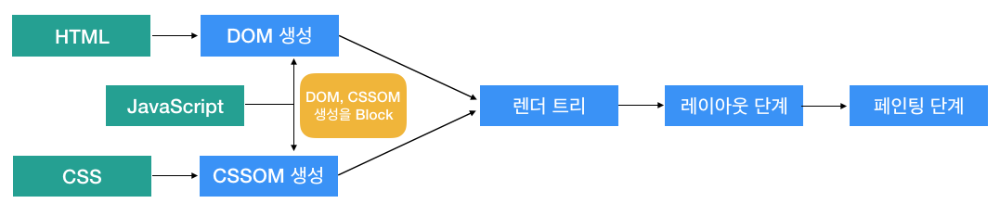

# CRP (Critical Rendering Path)

CRP (Critical Rendering Path): 주요 렌더링 경로

브라우저가 리소스 (HTML, CSS, JS)를 전달 받은뒤 픽셀로 변환하여 렌더링하기 위한 처리과정

1. [DOM, CSSOM 생성](#1-dom-cssom-생성)
2. [렌더 트리 생성](#2-렌더-트리-생성)
3. [레이아웃 단계](#3-레이아웃-단계)
4. [페인팅 단계](#4-페인팅-단계)

## 1. DOM, CSSOM 생성

**DOM (Document Object Model) 생성**

  - HTML 을 파싱해서 트리 형태의 데이터 구조 생성
  - HTML 파서는 `<script>` 태그를 만나면 DOM 생성을 중지하고 JS 엔진에게 제어권한을 넘김 (외부 리소스일 경우 다운로드를 기다림)
  - JS 실행이 완료되면 DOM 을 다시 생성해 나감
  - 스크립트 실행 시점에 CSSOM 이 생성되지 않았다면 CSSOM 생성을 기다림

**CSSOM (CSS Object Model) 생성**

  - CSS 를 파싱해서 트리 형태의 데이터 구조 생성

  * 렌더링을 차단하는 CSS
    - 브라우저는 CSSOM 이 완성될 때 까지 렌더링을 하지 않음
    - 때문에, CSS 는 최대한 빠르게 다운로드 되어야함
    - 미디어 유형, 미디어 쿼리를 사용해 렌더링을 블락하지 않도록 설정해줄 수 있음
    - 블락에 상관없이 브라우저는 모든 CSS를 다운로드함
  
  * JavaScript
    - JavaScript 실행은 CSSOM 의 생성을 차단함
    - `<script>` 태그의 JavaScript 는 비동기(async, defer) 선언이 없을 경우, DOM 생성을 차단함 (inline, external 구분 없음)

## 2. 렌더 트리 생성

  - DOM 을 순회하면서 CSSOM 의 규칙을 적용해 컨텐츠와 개별 노드의 스타일을 계산해 렌더 트리를 생성

  - 렌더 트리의 개별노드에 대한 스타일은 계산이 되었지만 페이지 상에 정확한 위치는 정해지지 않은 상태

## 3. 레이아웃 단계

  - 렌더 트리를 순회하면서 각 노드의 정확한 위치를 계산함

## 4. 페인팅 단계

  -  렌더 트리의 각 노드를 실제 픽셀로 변환 
