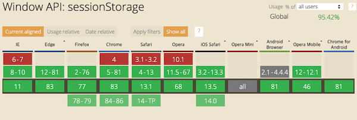
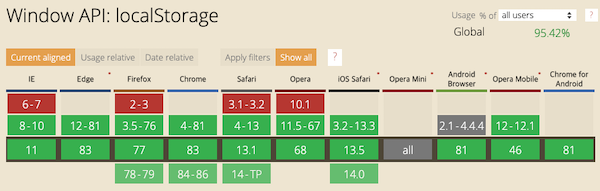

# 브라우저의 스토리지

* [Cookie](#Cookie)
* [웹 스토리지](#웹-스토리지-Session-Storage-Local-Storage)
* [Index DB](#IndexDB)
* [Summary](#Summary)

## Cookie

쿠키는 브라우저에 저장될 수 있는 문자열입니다.

#### 특징

- 쿠키는 클라이언트가 통신하는 서버에 의해서 설정 될 수 있습니다.

#### Browser Cookie API

`document.cookie` 에 값을 할당, 읽음으로 쿠키값을 설정할 수 있습니다.

```js
document.cookie = "foo=1";
document.cookie = "bar=2";

console.log(document.cookie); // foo=1; bar=1
```

## 웹 스토리지 (Session Storage, Local Storage)

웹 스토리지(Session Storage, Local Storage) 에는 "키", "값" 쌍을 저장할 수 있습니다.

#### 공통 특징
 * HTTP 헤더를 통해 웹 스토리지를 조작할 수 없습니다.
 * 브라우저에 따라 약 4~5MB 까지 데이터를 저장할 수 있습니다.
 * 도메인 + 프로토콜 + 포트번호 의 오리진에 따라 새로운 스토리지가 생성됩니다.
 * Local Storage, Session Storage 는 동일한 인터페이스를 가지고 있습니다.
   * `setItem(key, value)`: 키-값 쌍 저장
   * `getItem(key)`: 키에 따른 값 반환
   * `removeItem(key)`: 키에 따른 값 삭제
   * `clear()`: 스토리지를 비움

#### Session Storage 특징
 * 브라우저 탭/윈도우 별로 새로운 SessionStorage가 생성됩니다.
 * 탭/윈도우를 닫으면 SessionStorage는 초기화됩니다.

#### Local Storage 특징
 * 탭/윈도우에 관계 없이 데이터를 공유합니다.
 * 브라우저가 재시작 되어도 데이터가 유지됩니다.

#### Session Storage/Local Storage 브라우저 지원 현황
* Session Storage - [출처: can i use sessionStorage?](https://caniuse.com/#search=SessionStorage)

  

* Local Storage - [출처: can i use localStorage?](https://caniuse.com/#search=LocalStorage)

  

## IndexedDB
