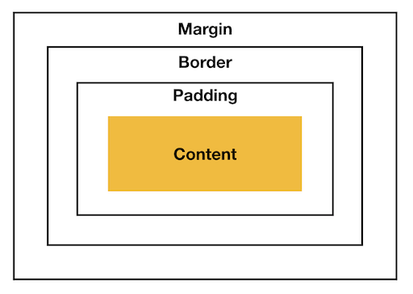

<!--meta
title: box-sizing - CSS - dev-blog
description: CSS box-sizing 정리
keywords: box-sizing, CSS, content-box, border-box
-->

# box-sizing

box-sizing 속성을 통해 요소의 너비와 높이를 어떤 것을 기준으로 계산할지 지정할 수 있다.
box-sizing 속성은 값으로 `content-box`(기본값) 또는 `border-box` 을 가진다.

## content-box

width, height 값에 padding 과 border 영역은 포함되지 않도록 한다.

##  border-box

width, height 값에 padding 과 border 영역도 포함된다.
