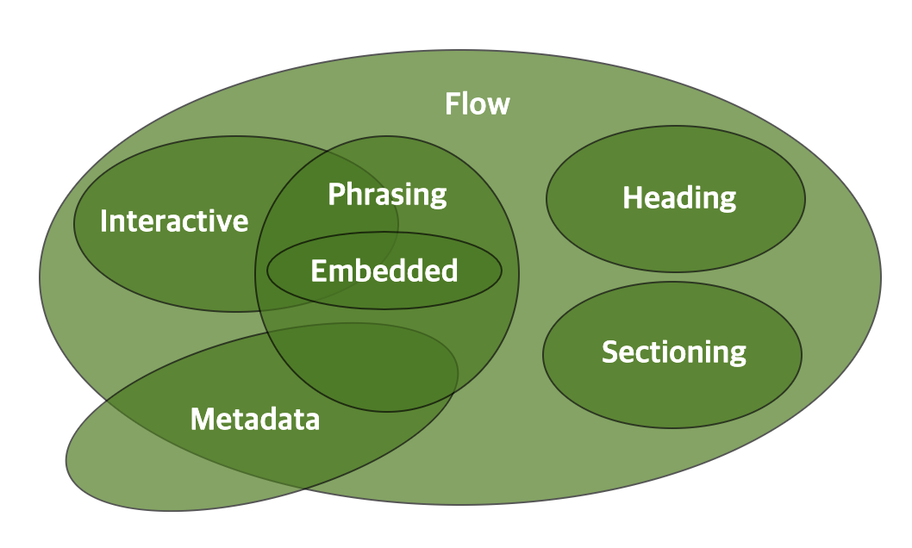

# HTML 콘텐츠 분류

## HTML 컨텐츠 분류

HTML 요소는 아래 컨텐츠 분류에 속한다.

- Metadata content
- Flow content
- Sectioning content
- Heading content
- Phrasing content
- Embedded content
- Interactive content


*from [https://html.spec.whatwg.org/multipage/dom.html#kinds-of-content](https://html.spec.whatwg.org/multipage/dom.html#kinds-of-content)*


## Metadata content

메타데이터 컨텐츠는 내용의 표시, 동작을 설정 하거나, 문서와 다른 문서와의 관계를 설정할 수 있는 컨텐츠이다.

```
base, link, meta, noscript, script, style, template, title
```

## Flow content

body 안에서 사용되는 대부분의 요소는 Flow content 에 속한다.

```
a, abbr, address, area, map, article, aside, audio, b, bdi, bdo,
blockquote, br, button, canvas, cite, code, data, datalist, del,
details, dfn, dialog, div, dl, em, embed, fieldset, figure,
footer, form, h1, h2, h3, h4, h5, h6, header, hgroup, hr, i,
iframe, img, input, ins, kbd, label, link, main, map, mark, math,
menu, meta, meter, nav, noscript, object, ol, output, p, picture,
pre, progress, q, ruby, s, samp, script, section, select, slot,
small, span, strong, sub, sup, svg, table, template, textarea,
time, u, ul, var, video, wbr, autonomous custom elements, text
```

## Sectioning content

headings, footers 의 범위를 설정하는 요소이다.
각 Sectioning content 요소는 개요를 생성할 수 있다.

```
article, aside, nav, section
```

## Heading content

Heading content 는 section 의 헤더를 정의한다. 
Sectioning content 와 같이 쓰여서 명시적으로 개요가 생성된다. 같이 쓰이지 않더라도 암묵적으로 개요를 생성한다.

```
h1, h2, h3, h4, h5, h6, hgroup
```

## Phrasing content

문서에서 텍스트에 해당하는 부분이다.

```
a, abbr, area, audio, b, bdi, bdo, br, button, canvas, cite, code,
data, datalist, del, dfn, em, embed, i, iframe, img, input, ins,
kbd, label, link, map, mark, math, meta, meter,         , object,
output, picture, progress, q, ruby, s, samp,       , select, slot,
small, span, strong, sub, sup, svg, template, textarea, time, u,
var, video, wbr, autonomous custom elements, text
```

## Embedded content

외부 자원을 문서안으로 불러오거나 참조한다. 

```
audio, canvas, embed, iframe, img, math, object, picture, svg,
  video
```

## Interactive content

사용자와 상호작용하도록 의도된 컨텐츠 이다.

```
a (href 속성이 있는 경우에만), audio, button, details, embed, iframe, img, input, label, select, textarea, video
```

## 기타 컨텐츠 분류


### Palpable content

일반적으로, Flow content 와 Phrasing content 를 허용하는 요소는 Palpable content 이다. 최소 하나 이상의 요소를 포함하여야 한다. 그런 요소를 Palpable content 라고 한다.

```
 a, abbr, address, article, aside, audio, b, bdi, bdo, blockquote,
  button , canvas, cite, code, data, details, dfn, div, dl, em,
  embed, fieldset, figure, footer, form, h1, h2, h3, h4, h5, h6,
  header, hgroup, i, iframe, img, input, ins, dbd, label, main, map,
  mark, math, menu, meter, nav, object, ol, output, p, pre,
  progress, g, ruby, s, samp, section, select, small, span, strong,
  sub, sup, svg, table, textarea, time, u, ul, var, video,
  autonomous custom elements, text that is not inter-element
  whitespace
```


### Script-supporting elements

그 요소 자체로는 아무것도 렌더링 되지 않지만 스크립트와 같이 사용자에게 다른 기능을 제공하기 위해 사용되는 요소이다.

```
script, template
```

### Transparent content models

몇몇 요소는 Transparent content model 을 따르는데, 이 요소들의 컨텐츠 모델은 그 부모 요소의 컨텐츠 모델을 따르게 된다.

```
a, ins, del, object, video, audio, map, noscript, canvas
```
